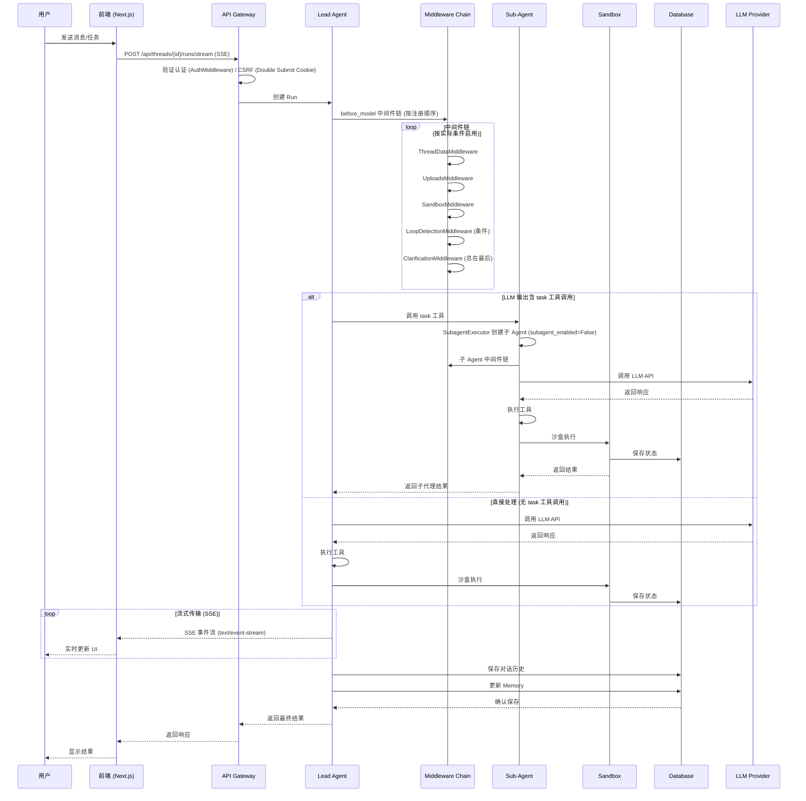
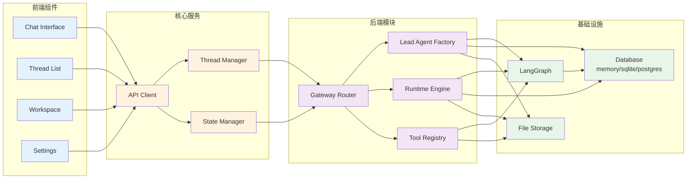
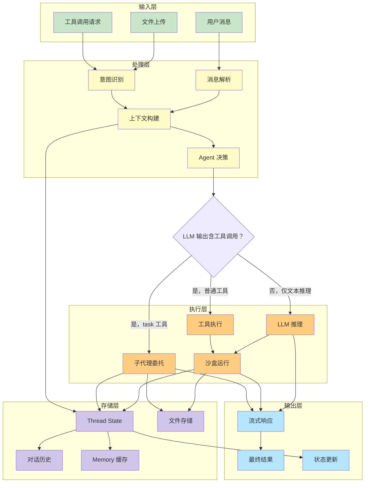
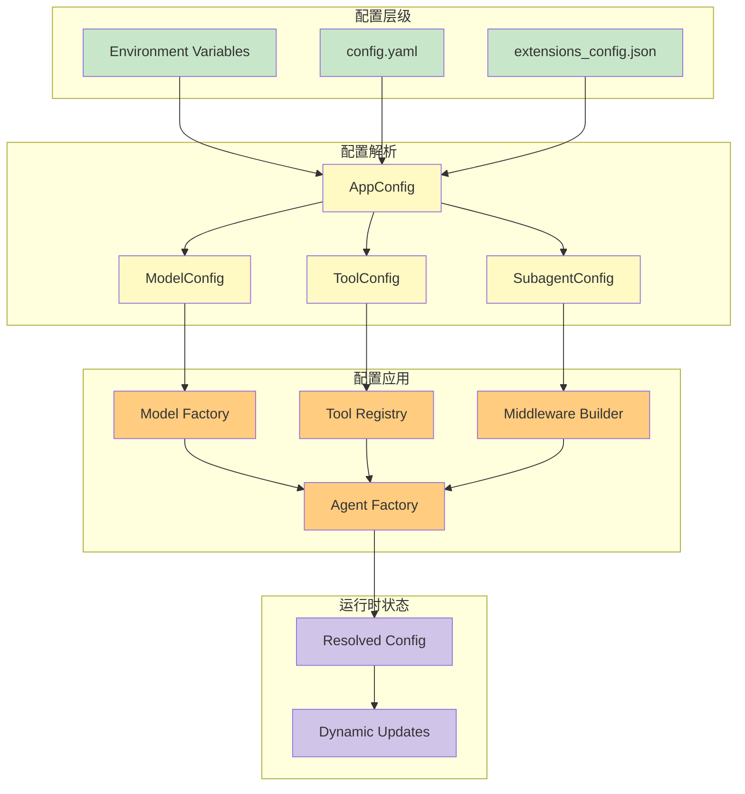

# DeerFlow 项目架构图

本文档展示了 DeerFlow 2.0 的完整系统架构，包括前后端组件、数据流和调用关系。

## 1. 整体系统架构

```mermaid
graph TB
    subgraph "前端层 (Frontend)"
        A1[Next.js 16 + React 19]
        A2[Tailwind CSS 4]
        A3[Shadcn UI 组件库]
        A4[LangGraph SDK]
        A5[TypeScript]
    end

    subgraph "API 网关层 (Gateway API)"
        B1[REST API Endpoints<br/>/api/threads/{id}/runs/*]
        B2[SSE Streaming<br/>text/event-stream]
        B3[Authentication<br/>AuthMiddleware]
        B4[CSRF Protection<br/>Double Submit Cookie]
    end

    subgraph "后端核心层 (Backend Core)"
        C1[DeerFlow Harness]
        C2[LangGraph Runtime]
        C3[Configuration System]
    end

    subgraph "Agent 运行时 (Agent Runtime)"
        D1[Lead Agent]
        D2[Middleware Chain]
        D3[Tool System]
        D4[Sub-Agent Executor]
    end

    subgraph "中间件层 (Middleware Layer，共 22 个)"
        E_RT["运行时基础链<br/>ToolOutputBudget / ThreadData / Uploads /<br/>Sandbox / DanglingToolCall / LLMErrorHandling /<br/>Guardrail / SandboxAudit / ToolErrorHandling"]
        E_CTX["上下文增强<br/>DynamicContext / SkillActivation /<br/>Summarization / Todo / TokenUsage"]
        E_META["元数据与记忆<br/>Title / Memory / ViewImage"]
        E_CTRL["安全与控制<br/>DeferredToolFilter / SubagentLimit /<br/>LoopDetection / SafetyFinishReason / Clarification"]
        E_RT --> E_CTX --> E_META --> E_CTRL
    end

    subgraph "执行层 (Execution Layer)"
        F1[Sandbox Executor]
        F2[Local Execution]
        F3[Docker Container]
        F4[Skill System]
    end

    subgraph "数据持久层 (Persistence Layer，可配置多后端)"
        G1[Database Backend<br/>默认 memory 可选 sqlite / postgres]
        G2[Checkpointer<br/>InMemory / Sqlite / Postgres]
        G3[Store<br/>InMemory / Sqlite / Postgres]
        G4[Memory Storage<br/>SQLAlchemy Async]
    end

    subgraph "外部集成 (External Integrations)"
        H1[MCP Servers]
        H2[LLM Providers]
        H3[File System]
        H4[Vector DB]
    end

    A1 --> B1
    A2 --> B1
    A3 --> B1
    A4 --> B1
    A5 --> B1
    
    B1 --> C1
    B2 --> C1
    B3 --> C1
    B4 --> C1
    
    C1 --> D1
    C1 --> C2
    C1 --> C3
    
    D1 --> D2
    D1 --> D3
    D1 --> D4
    
    D2 --> E_RT

    D3 --> H1
    D3 --> H2
    
    D4 --> F1
    D4 --> F4
    
    F1 --> F2
    F1 --> F3
    
    D1 --> G1
    D2 --> G1
    F1 --> G1
    C2 --> G2
    C2 --> G3
    
    H1 --> G4
    H2 --> D1
    H3 --> F2
    H3 --> F3
    H4 --> G4

    style A1 fill:#e1f5ff
    style B1 fill:#fff3e0
    style C1 fill:#f3e5f5
    style D1 fill:#e8f5e9
    style E_RT fill:#fce4ec
    style F1 fill:#ffebee
    style G1 fill:#e0f2f1
    style H1 fill:#f5f5f5
```

## 2. 请求处理流程



## 3. 组件依赖关系



## 4. 数据流架构



## 5. 中间件链构建与执行顺序

> **重要说明（与旧版差异）**：中间件并非固定的 13 节点线性链，而是由 `build_lead_runtime_middlewares()`（`tool_error_handling_middleware.py:129`）+ `build_middlewares()`（`agent.py:270`）**两阶段、大量条件性追加**构建。`before_model` / `after_model` 钩子由 LangChain 按**注册逆序**触发（before 正序、after 逆序），并非简单的镜像反转。下图反映实际构建顺序。

```mermaid
graph TD
    A[make_lead_agent 入口] --> P1[阶段1: build_lead_runtime_middlewares]

    subgraph S1["阶段1 运行时基础链（顺序固定）"]
        R1[ToolOutputBudgetMiddleware] --> R2[ThreadDataMiddleware]
        R2 --> R3[UploadsMiddleware]
        R3 --> R4[SandboxMiddleware]
        R4 --> R5[DanglingToolCallMiddleware]
        R5 --> R6[LLMErrorHandlingMiddleware]
        R6 --> R7{guardrails.enabled?}
        R7 -->|是| R8[GuardrailMiddleware]
        R7 -->|否| R9[SandboxAuditMiddleware]
        R8 --> R9
        R9 --> R10[ToolErrorHandlingMiddleware]
    end

    P1 --> P2[阶段2: build_middlewares 追加]

    subgraph S2["阶段2 条件性追加"]
        R10 --> R11[DynamicContextMiddleware]
        R11 --> R12[SkillActivationMiddleware]
        R12 --> R13{summarization.enabled?}
        R13 -->|是| R14[SummarizationMiddleware]
        R13 -->|否| R15{is_plan_mode?}
        R14 --> R15
        R15 -->|是| R16[TodoMiddleware]
        R15 -->|否| R17{token_usage.enabled?}
        R16 --> R17
        R17 -->|是| R18[TokenUsageMiddleware]
        R17 -->|否| R19[TitleMiddleware]
        R18 --> R19
        R19 --> R20[MemoryMiddleware]
        R20 --> R21{model.supports_vision?}
        R21 -->|是| R22[ViewImageMiddleware]
        R21 -->|否| R23{deferred_setup?}
        R22 --> R23
        R23 -->|有 deferred| R24[DeferredToolFilterMiddleware]
        R23 -->|否| R25{subagent_enabled?}
        R24 --> R25
        R25 -->|是| R26[SubagentLimitMiddleware max=3]
        R25 -->|否| R27{loop_detection.enabled?}
        R26 --> R27
        R27 -->|是| R28[LoopDetectionMiddleware]
        R27 -->|否| R29[custom_middlewares 注入点]
        R28 --> R29
        R29 --> R30{safety_finish_reason.enabled?}
        R30 -->|是| R31[SafetyFinishReasonMiddleware]
        R30 -->|否| R32[ClarificationMiddleware]
        R31 --> R32
    end

    R32 --> LLM[LLM 节点调用]
    LLM --> Hooks[before_model 正序触发 / after_model 逆序触发]

    style A fill:#ffebee
    style S1 fill:#fff3e0
    style S2 fill:#e8f5e9
    style LLM fill:#fff4e1
    style R32 fill:#e1ffe1
```



**钩子触发方向**：
- `before_model`：按上图中**注册顺序**正向执行（先 ToolOutputBudget → ... → 最后 Clarification）
- `after_model`：按**注册逆序**执行（先 Clarification 处理 → ... → 最后 ToolOutputBudget）

> 这解释了为何 `SafetyFinishReasonMiddleware` 在代码注释中特意排在 `custom_middlewares` 之后：为了让它在逆序的 after_model 中**最先**执行，从而在 Loop/Subagent 计数之前清空 tool_calls。

## 6. 配置系统架构



## 关键组件说明

### 前端层
- **Next.js 16**: 提供服务端渲染和静态生成
- **React 19**: 最新的 React 版本，支持 Server Components
- **Tailwind CSS 4**: 原子化 CSS 框架
- **LangGraph SDK**: 与后端 LangGraph 的客户端通信

### 后端核心层
- **DeerFlow Harness**: 核心代理框架
- **LangGraph Runtime**: 代理运行时管理
- **Configuration System**: 统一配置管理

### Agent 运行时
- **Lead Agent**: 主代理，作为运行时入口点（由模块级函数 `make_lead_agent` 构建，非工厂类）
- **Middleware Chain**: 最多 **22 个**中间件，分两阶段条件性构建（见上图）
- **Tool System**: 工具注册和执行系统
- **Sub-Agent Executor**: 子代理异步执行引擎（`ThreadPoolExecutor(max_workers=3)` + 独立事件循环）

### 中间件层
中间件基于 LangChain 的 `before_model` / `after_model` 钩子，按注册顺序（before）与逆序（after）触发，多数为条件性启用

### 执行层
- **Sandbox Executor**: 代码执行环境
- **Local Execution**: 本地执行模式
- **Docker Container**: 隔离的容器执行
- **Skill System**: 按需加载的技能模块

### 数据持久层（可配置多后端）
- **Database Backend**: 默认 `memory`（开发用，重启即失），可选 `sqlite` / `postgres`（生产）
- **Checkpointer**: 检查点机制，支持断点续传（InMemory / Sqlite / Postgres）
- **Store**: 键值存储（InMemory / Sqlite / Postgres）
- **Memory Storage**: SQLAlchemy 异步引擎驱动的记忆系统
- ⚠️ **Redis**: 仅在文档中规划（Phase 2），尚未实现

---

*本文档由 DeerFlow 项目自动生成*
