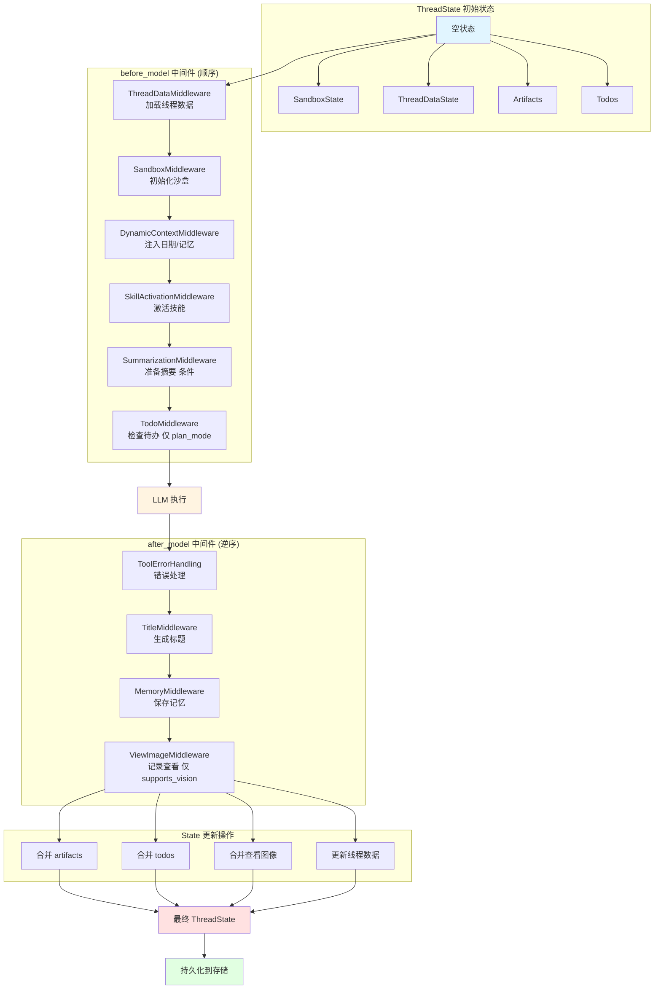
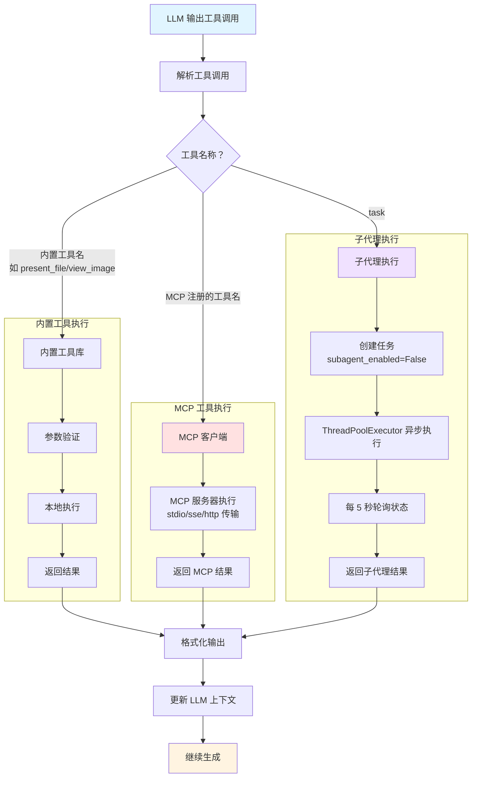
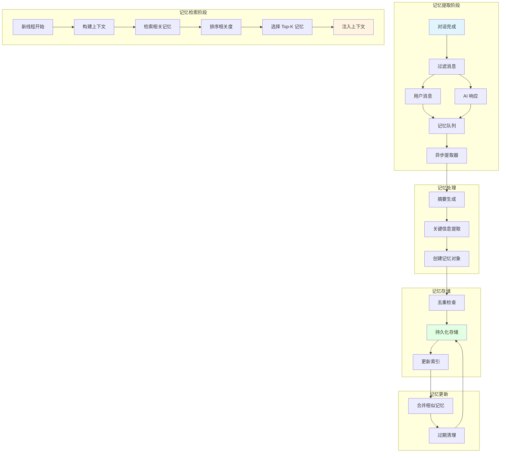
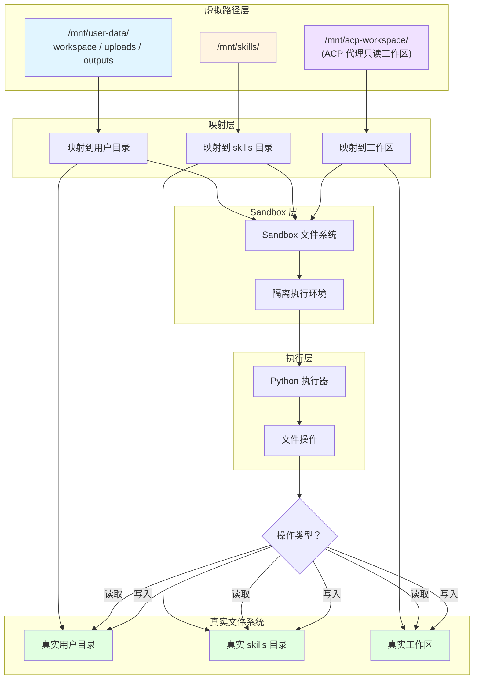
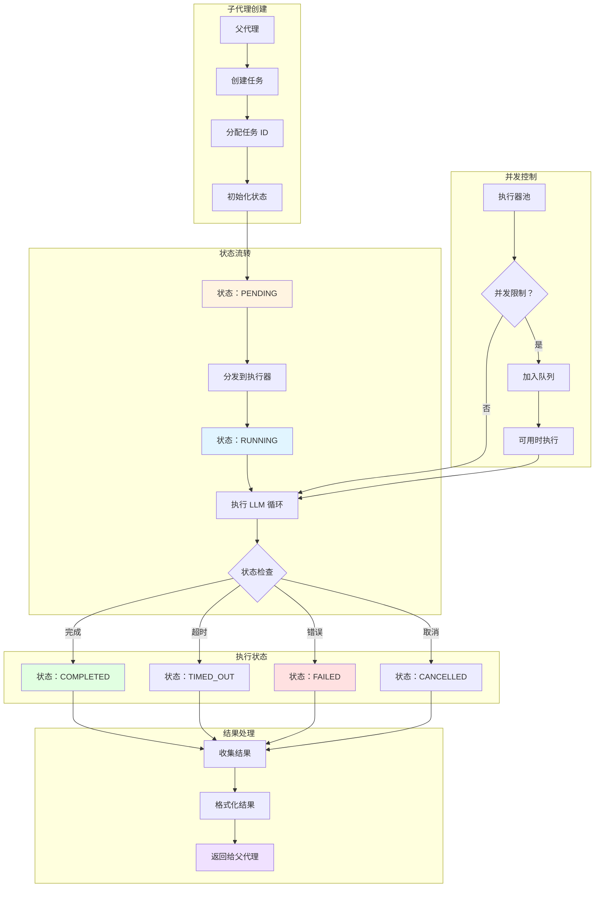

# DeerFlow 数据流图

本文档包含 DeerFlow 项目的数据流相关 Mermaid 流程图，展示数据如何在系统各组件之间流动。

## 1. 请求数据流图

展示用户请求从前端到后端处理的完整数据流动过程。

```mermaid
graph TB
    Start([用户请求]) --> Auth[API Gateway<br/>AuthMiddleware 认证<br/>+ CSRF 校验]
    Auth --> Parse[请求解析<br/>POST /api/threads/&#123;id&#125;/runs/stream]
    
    Parse --> ThreadCheck{线程已有运行中 Run？}
    ThreadCheck -->|是，且需等待| JoinRun[joinStream 重连现有 Run]
    ThreadCheck -->|否| NewRun[创建新 Run]
    
    JoinRun --> BuildChain[构建中间件链]
    NewRun --> BuildChain
    
    BuildChain --> BeforeChain[before_model 中间件链<br/>按注册顺序触发]
    
    BeforeChain --> Prepare[准备 LLM 请求]
    Prepare --> ContextBuild[构建上下文]
    ContextBuild --> ModelSelect[模型选择]
    
    ModelSelect --> LLMCall[LLM API 调用]
    LLMCall --> ToolCheck{LLM 输出含工具调用？}
    
    ToolCheck -->|是，普通工具| ToolExec[工具执行]
    ToolCheck -->|是，task 工具| SubAgent[委托子代理]
    ToolCheck -->|否| FormatResp[格式化响应]
    
    ToolExec --> ToolResult[工具结果]
    ToolResult --> UpdateState[更新 ThreadState]
    UpdateState --> LLMCall
    
    SubAgent --> ToolResult
    FormatResp --> AfterChain[after_model 中间件链<br/>按注册逆序触发]
    
    AfterChain --> MemoryUpdate[更新 Memory<br/>MemoryMiddleware 异步]
    AfterChain --> StatePersist[状态持久化]
    
    MemoryUpdate --> Persist[持久化]
    StatePersist --> Persist
    
    Persist --> SSE[通过 SSE 连接返回]
    Frontend[前端经 SSE 长连接接收]
    SSE --> Frontend
    Frontend --> End([完成])
    
    style Start fill:#e1f5ff
    style End fill:#ffe1e1
    style LLMCall fill:#fff4e1
    style ToolExec fill:#f0e1ff
    style Persist fill:#e1ffe1
```

## 2. 流式响应数据流图

展示 SSE 流式响应的数据流动过程。

```mermaid
sequenceDiagram
    participant User as 用户
    participant Frontend as 前端
    participant API as API Gateway
    participant Agent as Agent Runtime
    participant Middleware as 中间件链
    participant LLM as LLM Provider
    participant State as 状态存储
    
    User->>Frontend: 发送消息
    Frontend->>API: POST /api/threads/&#123;id&#125;/runs/stream (SSE)
    API->>Agent: 创建运行
    Agent->>Middleware: before_model 中间件链
    
    loop 流式生成
        Middleware->>LLM: 流式请求
        LLM-->>Middleware: 流式 token
        Middleware->>Middleware: 中间件处理
        Middleware->>Agent: yield token
        Agent->>API: 发送 SSE 事件
        API->>Frontend: SSE: token
        Frontend->>User: 显示 token
    end
    
    loop 工具调用
        LLM-->>Middleware: 工具调用
        Middleware->>Agent: 执行工具
        Agent-->>Middleware: 工具结果
        Middleware->>LLM: 携带工具结果继续
        LLM-->>Middleware: 更多 token
    end
    
    Agent->>Middleware: after_model 中间件链 (逆序)
    Agent->>Agent: 完成标记
    Agent->>State: 持久化 ThreadState
    Agent->>API: 完成事件
    API->>Frontend: SSE: end
    Frontend->>User: 显示完成
```

## 3. 状态数据流图

展示 ThreadState 在各中间件之间的数据流动和更新。

## 4. 工具调用数据流图

展示工具调用的完整数据流，包括内置工具和 MCP 工具。

## 5. 记忆系统数据流图

展示 Memory 系统的数据提取、存储和检索流程。

## 6. Sandbox 文件系统数据流图

展示 Sandbox 中的虚拟路径映射和文件系统操作。

## 7. 子代理执行数据流图

展示子代理的异步执行和状态流转。

## 图表说明

### 颜色图例
- `#e1f5ff` (蓝色): 起始/输入状态
- `#fff4e1` (黄色): 处理/执行状态
- `#f0e1ff` (紫色): 特殊功能
- `#e1ffe1` (绿色): 完成/输出状态
- `#ffe1e1` (红色): 错误/终止状态

### 数据流特点
1. **流式处理**: 所有响应都通过 SSE 流式传输，实现实时交互
2. **状态管理**: ThreadState 作为单一事实源，所有中间件共享和更新
3. **异步执行**: 子代理、记忆提取等操作异步执行，不阻塞主流程
4. **隔离执行**: Sandbox 提供隔离的执行环境，保护系统安全
5. **持久化**: 所有状态和记忆都会持久化到存储，支持跨会话

### 关键数据对象
- **ThreadState**: 包含所有运行时状态的 TypedDict
- **Run**: 运行记录，包含完整的执行历史
- **Memory**: 持久化的对话记忆
- **Artifact**: 工具执行产生的数据文件
- **Todo**: 待办事项列表
