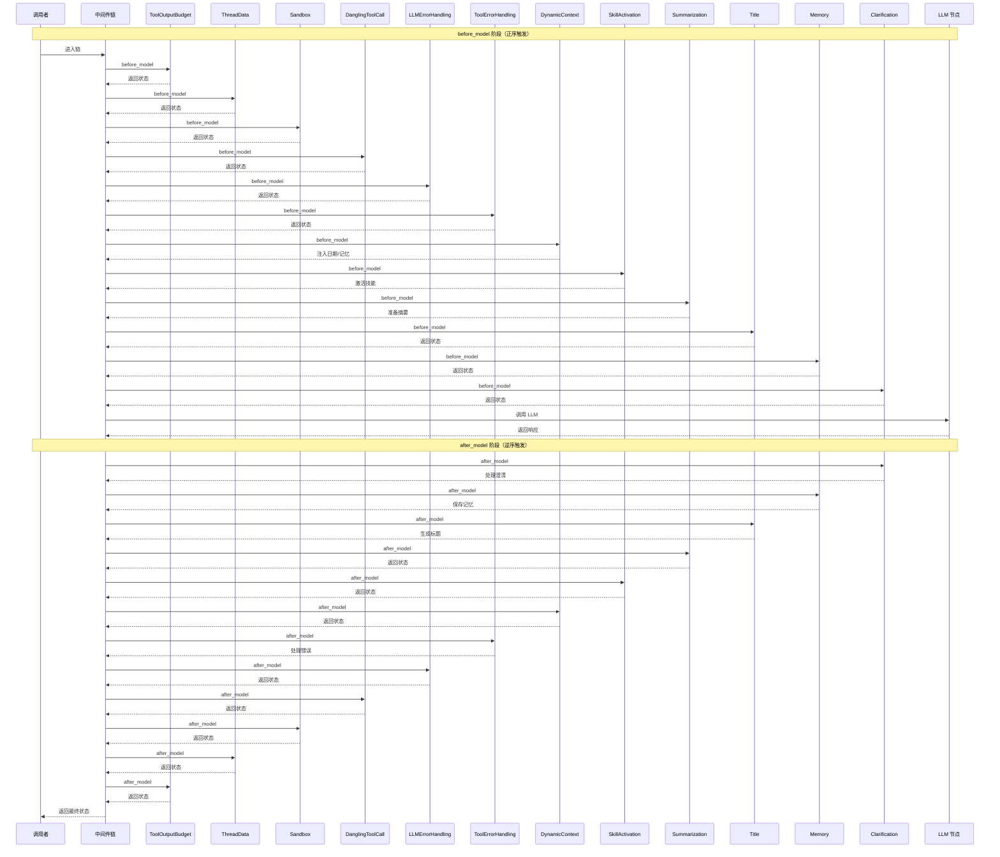
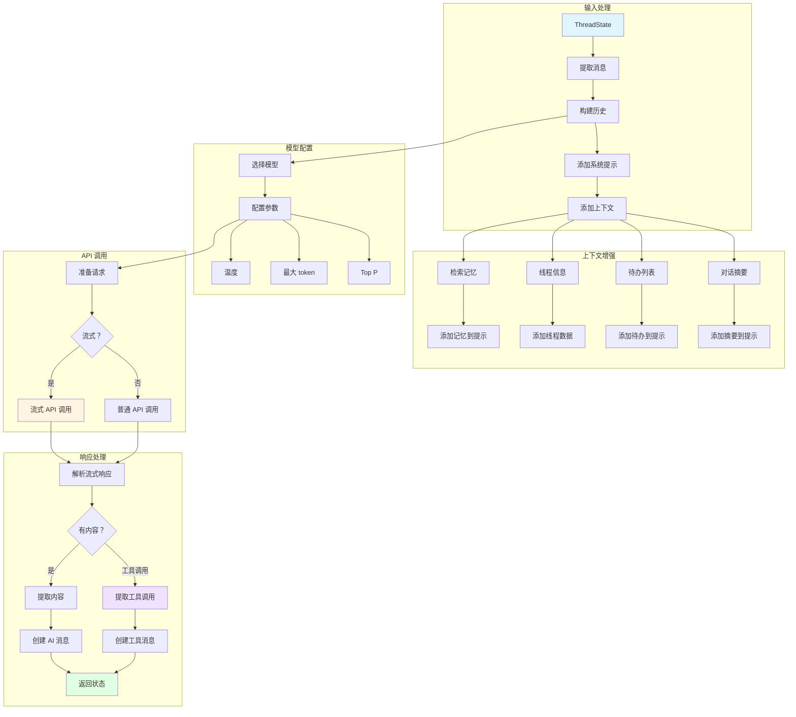
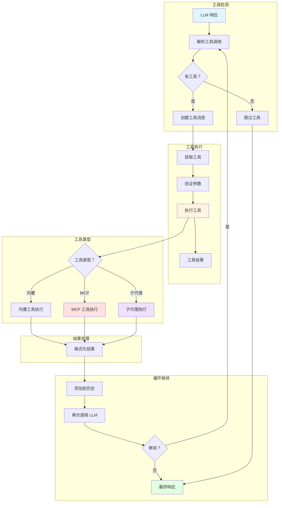
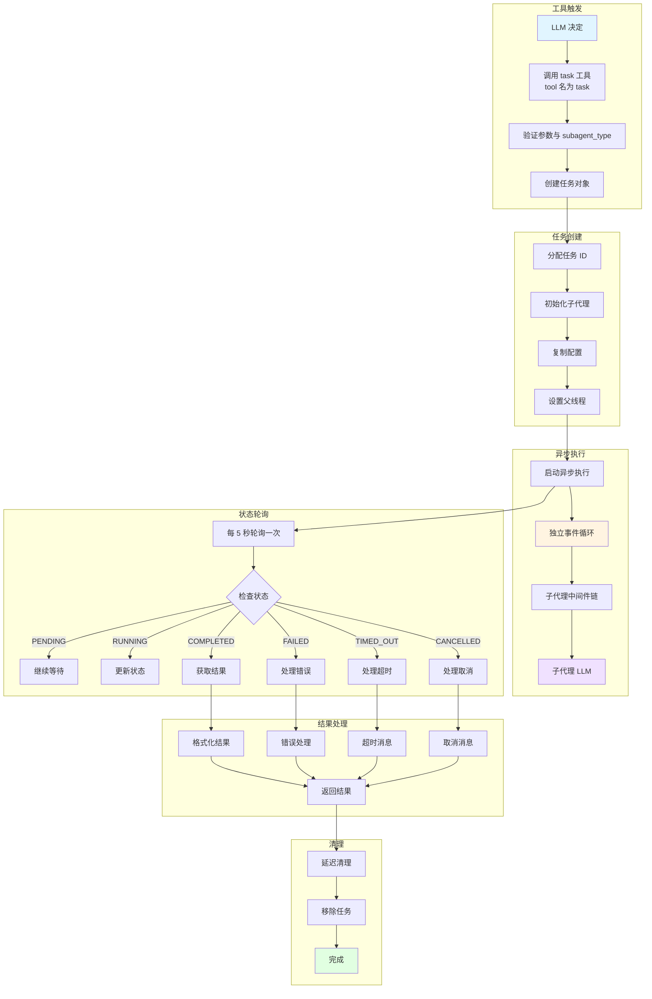
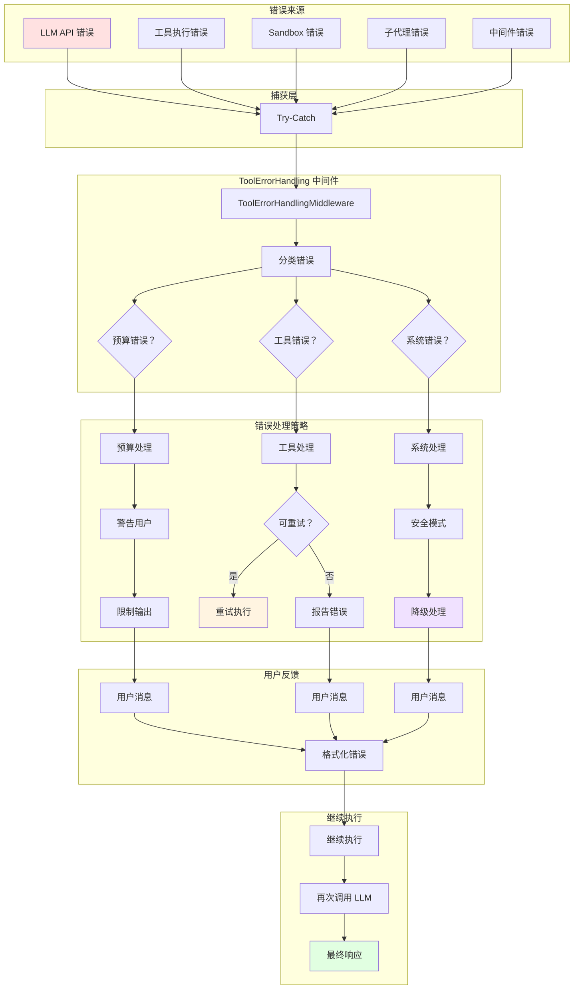

# DeerFlow Lead Agent 调用链图

本文档包含 Lead Agent 的完整调用链 Mermaid 流程图，展示从请求入口到最终响应的完整调用关系。

## 1. Lead Agent 构建图

> **重要修正**：代码中**不存在** `LeadAgentFactory` 工厂类。Lead Agent 由模块级函数 `make_lead_agent(config)`（`agent.py:402`）构建，内部调用 `build_middlewares(...)`（`agent.py:270`）装配中间件链，最终交给 LangChain `create_react_agent` / `create_agent` 编译为可执行图。

```mermaid
graph TB
    subgraph "入口函数"
        Entry[make_lead_agent&#40;config&#41;<br/>LangGraph 图工厂入口] --> ParseCfg[解析 RunnableConfig]
    end
    
    subgraph "配置解析"
        ParseCfg --> AppCfg[get_app_config]
        AppCfg --> ModelCfg[模型配置]
        AppCfg --> SkillsCfg[可用技能集合]
        ParseCfg --> RuntimeCfg[运行时配置<br/>is_plan_mode / subagent_enabled]
    end
    
    subgraph "中间件装配"
        RuntimeCfg --> BuildChain[build_middlewares<br/>两阶段条件构建]
        ModelCfg --> BuildChain
        BuildChain --> Runtime[build_lead_runtime_middlewares<br/>阶段1: 固定基础链]
        Runtime --> Append[阶段2: 条件性追加]
        SkillsCfg --> Append
    end
    
    subgraph "Agent 编译"
        Append --> MakeTools[装配工具<br/>内置/MCP/task]
        MakeTools --> CreateAgent[create_agent<br/>LangChain]
        CreateAgent --> Compile[编译为可执行图]
        Compile --> Agent[Lead Agent 实例]
    end
    
    style Entry fill:#e1f5ff
    style Agent fill:#e1ffe1
    style BuildChain fill:#fff4e1
    style Runtime fill:#f0e1ff
```

## 2. 请求处理调用链图

展示单个请求从 API 到响应的完整调用链。

```mermaid
graph TB
    subgraph "API 层"
        API[API Endpoint<br/>/api/runs] --> Controller[RunsController]
        Controller --> Validate[验证请求]
        Validate --> CreateRun[创建 Run 对象]
        CreateRun --> Stream[启动流式器]
    end
    
    subgraph "Agent 运行时"
        Stream --> Invoke[Agent.invoke<br/>异步]
        Invoke --> Execute[执行图节点]
        Execute --> State[获取 ThreadState]
    end
    
    subgraph "中间件链执行"
        State --> BeforeMiddleware[before_model 中间件链]
        
        BeforeMiddleware --> M1[ToolOutputBudget<br/>before_model]
        M1 --> M2[ThreadDataMiddleware<br/>before_model]
        M2 --> M3[UploadsMiddleware<br/>before_model]
        M3 --> M4[SandboxMiddleware<br/>before_model]
        M4 --> M5[DanglingToolCall<br/>before_model]
        M5 --> M6[DynamicContext<br/>before_model]
        M6 --> M7[SkillActivation<br/>before_model]
        M7 --> M8[Clarification<br/>总在最后]
        
        M8 --> CallAgent[调用 LLM 节点]
    end
    
    subgraph "LLM 执行"
        CallAgent --> BuildPrompt[构建提示词]
        BuildPrompt --> AddContext[添加上下文]
        AddContext --> LLMAPI[LLM API 调用]
        LLMAPI --> Response[获取响应]
        Response --> Parse[解析响应]
    end
    
    subgraph "工具执行"
        Parse --> ToolCheck{工具调用？}
        ToolCheck -->|是 | ToolExec[执行工具]
        ToolCheck -->|否 | Format[格式化输出]
        
        ToolExec --> ToolResult[工具结果]
        ToolResult --> UpdateState[更新状态]
        UpdateState --> CallAgent
    end
    
    subgraph "After 中间件"
        Format --> AfterMiddleware[after_model 中间件链 逆序]
        
        AfterMiddleware --> M9[Clarification<br/>after_model 先触发]
        M9 --> M10[LoopDetection<br/>after_model]
        M10 --> M11[SubagentLimit<br/>after_model]
        M11 --> M12[Memory<br/>after_model]
        M12 --> M13[Title<br/>after_model]
        M13 --> M14[ToolErrorHandling<br/>after_model 后触发]
    end
    
    subgraph "完成"
        M14 --> Yield[Yield 完成]
        Yield --> FinalState[返回最终状态]
        FinalState --> Persist[持久化]
        Persist --> SSE[SSE 完成事件]
    end
    
    style API fill:#e1f5ff
    style CallAgent fill:#fff4e1
    style ToolExec fill:#f0e1ff
    style Persist fill:#e1ffe1
    style SSE fill:#e1f5ff
```

## 3. 中间件链调用顺序图

> **修正说明**：实际为两阶段条件构建，最多 22 个中间件。`before_model` 按注册顺序触发，`after_model` 按注册逆序触发。下图展示典型完整链的钩子触发顺序（省略部分条件性中间件）。

## 4. 条件中间件启用图

> **修正说明**：旧版"有工具？/有沙盒？/需要澄清？"等判断多数是臆造的。下图依据 `build_middlewares()`（`agent.py:270-377`）的真实条件编写。注意 `ClarificationMiddleware` **总是最后注册**（无任何条件），并非旧版画的"需要澄清才启用"。

```mermaid
graph TD
    Start[build_lead_runtime_middlewares<br/>阶段1 固定基础链] --> Base[固定注册:<br/>ToolOutputBudget→ThreadData→Uploads→Sandbox<br/>→DanglingToolCall→LLMErrorHandling→SandboxAudit→ToolErrorHandling]
    
    Base --> Guardrail{guardrails.enabled?}
    Guardrail -->|是| AddGuardrail[插入 GuardrailMiddleware]
    Guardrail -->|否| DynCtx
    
    AddGuardrail --> DynCtx[DynamicContextMiddleware 总是注册]
    DynCtx --> Skill[SkillActivationMiddleware 总是注册]
    
    Skill --> Q1{summarization.enabled?}
    Q1 -->|是| AddSum[SummarizationMiddleware]
    Q1 -->|否| Q2
    AddSum --> Q2{is_plan_mode?}
    
    Q2 -->|是| AddTodo[TodoMiddleware]
    Q2 -->|否| Q3
    AddTodo --> Q3{token_usage.enabled?}
    
    Q3 -->|是| AddToken[TokenUsageMiddleware]
    Q3 -->|否| Title
    AddToken --> Title[TitleMiddleware 总是注册]
    
    Title --> Memory[MemoryMiddleware 总是注册]
    Memory --> Q4{model.supports_vision?}
    Q4 -->|是| AddView[ViewImageMiddleware]
    Q4 -->|否| Q5
    AddView --> Q5{deferred_setup 非空?}
    
    Q5 -->|有 deferred 工具| AddDeferred[DeferredToolFilterMiddleware]
    Q5 -->|否| Q6
    AddDeferred --> Q6{subagent_enabled?}
    
    Q6 -->|是| AddSubLimit[SubagentLimitMiddleware max=3]
    Q6 -->|否| Q7
    AddSubLimit --> Q7{loop_detection.enabled?}
    
    Q7 -->|是| AddLoop[LoopDetectionMiddleware]
    Q7 -->|否| Custom
    AddLoop --> Custom[custom_middlewares 注入点]
    
    Custom --> Q8{safety_finish_reason.enabled?}
    Q8 -->|是| AddSafety[SafetyFinishReasonMiddleware]
    Q8 -->|否| Clarify
    AddSafety --> Clarify[ClarificationMiddleware 总在最后]
    
    Clarify --> End[返回完整中间件链]
    
    style Start fill:#e1f5ff
    style End fill:#e1ffe1
    style Base fill:#fff4e1
    style Clarify fill:#f0e1ff
```

**真实启用条件速查表**：

| 中间件 | 启用条件 | 代码位置 |
|---|---|---|
| ThreadData / Sandbox / Title / Memory | 总是注册 | agent.py |
| Summarization | `summarization.enabled` | agent.py:316 |
| Todo | `is_plan_mode == True` | agent.py:322 |
| TokenUsage | `token_usage.enabled` | agent.py:328 |
| ViewImage | `model_config.supports_vision` | agent.py:340 |
| SubagentLimit | `subagent_enabled`，max 默认 3 | agent.py:352 |
| LoopDetection | `loop_detection.enabled` | agent.py:359 |
| Guardrail | `guardrails_config.enabled` | tool_error_handling_middleware.py |
| SafetyFinishReason | `safety_finish_reason.enabled` | agent.py:372 |
| Clarification | **总是注册，必为最后** | agent.py:376 |

## 5. LLM 节点调用图

展示 LLM 节点内部的详细调用流程。

## 6. 工具调用处理图

展示工具调用的完整处理流程。

## 7. 子代理工具调用图

展示子代理工具 `task_tool` 的完整调用链。

## 8. 错误处理调用图

展示整个系统中的错误处理流程。

## 图表说明

### 组件颜色图例
- `#e1f5ff` (蓝色): 输入/起始状态
- `#fff4e1` (黄色): 处理/执行状态
- `#f0e1ff` (紫色): 特殊功能/子代理
- `#e1ffe1` (绿色): 完成/输出状态
- `#ffe1e1` (红色): 错误/异常状态

### 关键调用链
1. **请求处理链**: API → Agent → before_model 链 → LLM → 工具 → after_model 链 → 响应
2. **中间件链**: 最多 22 个中间件，两阶段条件构建，before_model 正序、after_model 逆序触发
3. **工具执行链**: 检测 → 验证 → 执行 → 结果 → 循环
4. **子代理链**: 触发（task 工具）→ 创建 → ThreadPoolExecutor 异步执行 → 每 5 秒轮询 → 结果 → 清理

### 设计模式
1. **图工厂模式**: `make_lead_agent` 作为 LangGraph 图工厂函数构建 Lead Agent（非工厂类）
2. **责任链模式**: 中间件链通过顺序调用实现关注点分离
3. **策略模式**: 不同工具类型使用不同的执行策略
4. **异步模式**: 子代理（ThreadPoolExecutor + 独立事件循环）和记忆提取使用异步执行
5. **状态模式**: ThreadState 管理所有运行时状态

### 扩展性设计
- 中间件可插拔，通过条件启用控制
- 工具系统支持内置、MCP、子代理等多种类型
- 模型配置可动态选择
- 错误处理策略可配置
