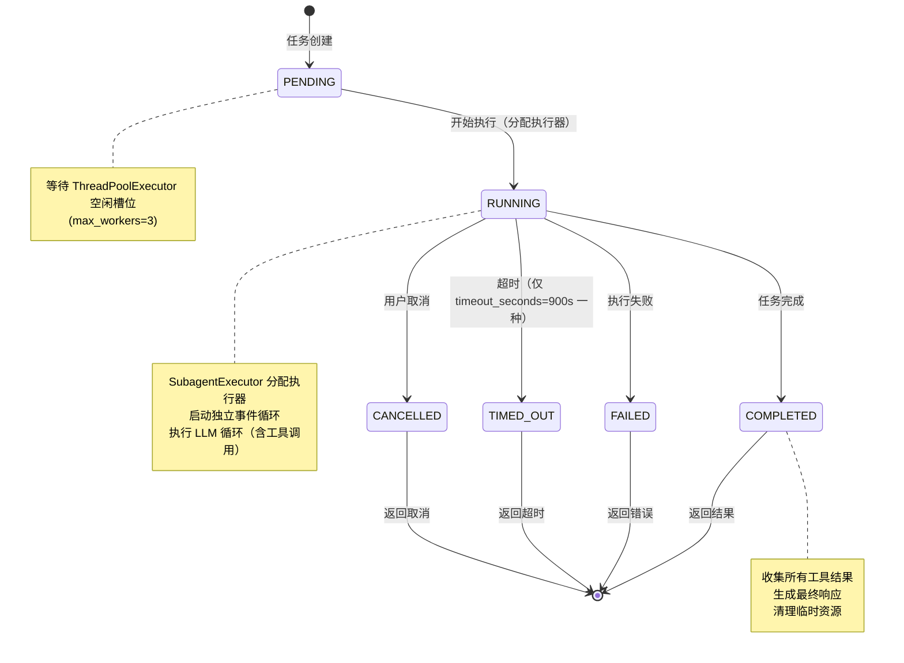
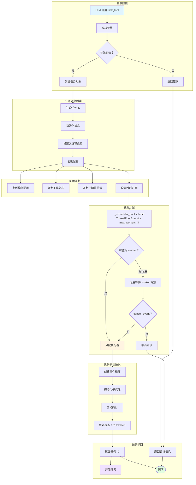
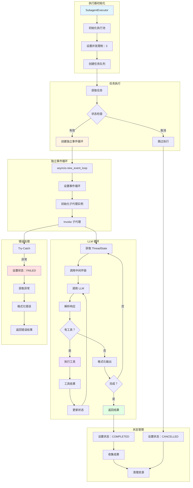
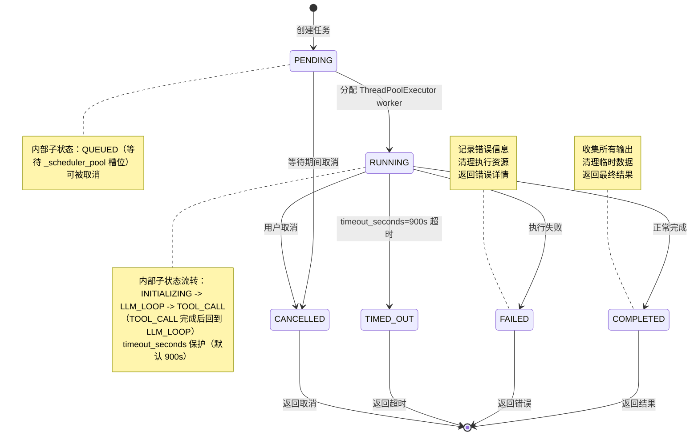
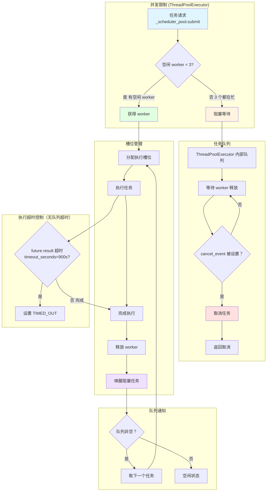
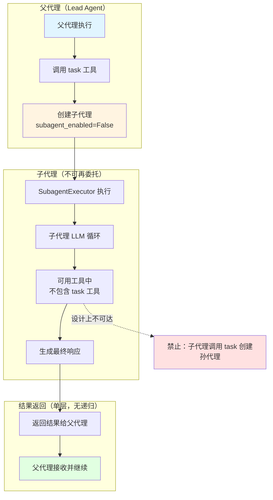
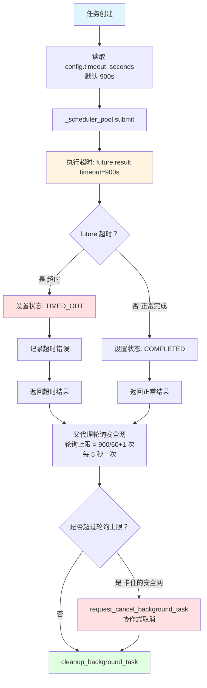
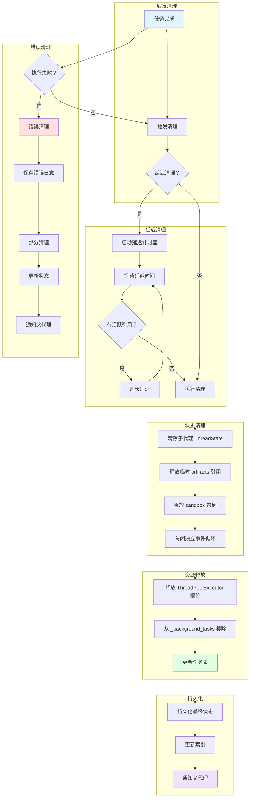

# DeerFlow 子代理执行流程图

本文档包含子代理系统的完整 Mermaid 流程图，展示子代理的创建、执行、状态管理和结果处理。

## 1. 子代理生命周期图

展示子代理从创建到完成的完整生命周期。



> **修正说明**：旧版含虚构的 `EXECUTING` 子状态与 `TIMEOUT` 状态名。实际 `SubagentStatus` 枚举为 `PENDING / RUNNING / COMPLETED / FAILED / CANCELLED / TIMED_OUT`（`executor.py:47-55`），无 `EXECUTING`，`RUNNING` 直接覆盖整个执行阶段。

## 2. 子代理创建流程图

展示子代理创建的完整流程。



## 3. 子代理执行引擎图

展示子代理执行引擎的核心执行流程。



## 4. 子代理状态流转图

展示子代理状态机的完整流转逻辑。



> **修正说明**：旧版含虚构的 `EXECUTING` 顶层状态、`TIMEOUT` 状态名以及"30 秒队列超时"。实际为 `PENDING → RUNNING`（内含 INITIALIZING/LLM_LOOP/TOOL_CALL 子状态），超时统一为 `TIMED_OUT`，无独立队列超时。

## 5. 子代理并发控制图

展示子代理的并发执行和队列管理机制。



## 6. 子代理结果轮询图

展示父代理轮询子代理结果的完整流程。

```mermaid
sequenceDiagram
    participant Parent as 父代理
    participant Poller as 轮询器
    participant Executor as 执行器
    participant Storage as 状态存储
    
    Parent->>Poller: 启动轮询 (task_id)
    
    loop 轮询循环
        Poller->>Storage: 获取任务状态
        Storage-->>Poller: 返回状态
        
        alt PENDING
            Poller->>Poller: asyncio.sleep(5)
        else RUNNING
            Poller->>Poller: asyncio.sleep(5)
        else COMPLETED
            Poller->>Storage: 获取结果
            Storage-->>Poller: 返回结果
            Poller->>Parent: 返回结果
            break 退出轮询
        else FAILED
            Poller->>Storage: 获取错误
            Storage-->>Poller: 返回错误
            Poller->>Parent: 返回错误
            break 退出轮询
        else TIMED_OUT
            Poller->>Parent: 返回超时
            break 退出轮询
        else CANCELLED
            Poller->>Parent: 返回取消
            break 退出轮询
        end
        
        Poller->>Poller: asyncio.sleep(5)
    end
    
    Parent->>Poller: 停止轮询 (可选)
    Poller-->>Parent: 轮询停止
```

## 7. 子代理嵌套调用图（嵌套被禁止）

> **重要修正**：旧版此处画了"子代理 1 → 子代理 2 → 子代理 3"的三层嵌套调用图。**代码明确禁止嵌套**：`task_tool.py:290-295` 中子代理创建时强制 `subagent_enabled=False`，注释写明 *"Subagents should not have subagent tools enabled (prevent recursive nesting)"*。因此子代理无法再创建孙代理。



**设计意图**：禁用嵌套可避免递归爆炸、简化状态管理与资源回收，并让父子任务边界清晰。需要并行/分解任务时，应由父代理并行调用多个子代理（受 `max_concurrent_subagents=3` 限制），而非让子代理层层下钻。

## 8. 子代理超时控制图

> **重要修正**：旧版声称存在"总体 15 分钟 / 空闲 5 分钟 / 队列 30 秒"三重超时。**代码中"空闲超时"和"队列超时"完全不存在**，仅有单一执行超时 `timeout_seconds`（默认 900 秒 = 15 分钟，`config.py:35`）加一个轮询安全网。



**真实超时机制**：
- **执行超时**：`future.result(timeout=self.config.timeout_seconds)`（`executor.py:693`、`executor.py:801`），由 `ThreadPoolExecutor` 的 `Future` 实现，唯一超时来源。
- **轮询安全网**：`task_tool.py:400-415`，作为"线程池超时万一失效"的兜底，轮询计数超过 `max_poll_count` 后协作式取消。
- **可配置**：`timeout_seconds` 可在 `config.yaml` 的 `subagents` 全局或 `agents.<name>` 单代理级别覆盖（`registry.py:83-90`）。

## 9. 子代理清理机制图

展示子代理完成后的资源清理流程。



## 10. 子代理工具调用时序图

展示子代理工具调用的完整时序。

```mermaid
sequenceDiagram
    participant LLM as LLM
    participant Parser as 解析器
    participant Tool as task_tool
    participant Executor as SubagentExecutor
    participant Parent as 父线程
    participant Storage as 存储
    
    LLM->>Parser: 输出工具调用
    Parser->>Tool: 调用 task_tool(args)
    
    Tool->>Tool: 验证参数
    Tool->>Executor: 创建执行器实例
    Executor->>Executor: 初始化子代理
    Executor->>Storage: 保存任务状态 (PENDING)
    
    Executor->>Executor: 检查并发限制
    alt 有可用槽位
        Executor->>Executor: 启动执行
        Executor->>Storage: 更新状态 (RUNNING)
    else 无可用槽位
        Executor->>Storage: 加入队列
        Storage->>Executor: 队列位置
    end
    
    Tool->>Executor: 返回 task_id
    Tool->>Parser: 返回工具调用结果
    
    Parser->>LLM: 继续执行 (task_id 待完成)
    
    loop 轮询结果
        Tool->>Storage: 查询任务状态
        Storage-->>Tool: 返回状态
        
        alt PENDING/RUNNING
            Tool->>Tool: 等待 5 秒
        else COMPLETED
            Storage->>Tool: 返回结果
            Tool->>Parser: 返回完整结果
            break
        else FAILED/TIMED_OUT/CANCELLED
            Storage->>Tool: 返回错误
            Tool->>Parser: 返回错误
            break
        end
    end
    
    Parser->>LLM: 工具调用结果
    LLM->>LLM: 生成最终响应
```

## 图表说明

### 状态图例
- **PENDING**: 任务已创建，等待 `_scheduler_pool`（ThreadPoolExecutor）槽位
- **RUNNING**: 正在执行，已分配执行器，内部含 INITIALIZING/LLM_LOOP/TOOL_CALL 子状态
- **COMPLETED**: 正常完成，有有效结果
- **FAILED**: 执行失败，有错误信息
- **TIMED_OUT**: 超时（单一执行超时 `timeout_seconds`，默认 900s）
- **CANCELLED**: 用户主动取消（协作式，经 `cancel_event`）

> 注：旧版的 `EXECUTING` 顶层状态与 `TIMEOUT` 状态名均已修正（无 EXECUTING，TIMEOUT→TIMED_OUT）。

### 关键参数
- **最大并发**: `MAX_CONCURRENT_SUBAGENTS = 3`，由 `_scheduler_pool = ThreadPoolExecutor(max_workers=3)` 实现（`executor.py:141`、`executor.py:821`）
- **执行超时**: `timeout_seconds` 默认 900 秒（15 分钟），`config.py:35`，可全局或单代理覆盖
- **轮询间隔**: **5 秒**（`asyncio.sleep(5)`，`task_tool.py:397`）
- **轮询安全网上限**: `timeout_seconds // 60 + 1` 次（`task_tool.py:400`）

### 设计特点
1. **异步执行**: 独立事件循环隔离子代理（`asyncio.new_event_loop`）
2. **并发控制**: `_scheduler_pool` 线程池限制最大并发数；另有 `SubagentLimitMiddleware` 截断 LLM 输出的并行 task 工具调用
3. **单一执行超时**: 由 `Future.result(timeout=...)` 实现，加轮询安全网兜底（无空闲/队列超时）
4. **状态轮询**: 父代理每 5 秒轮询子代理状态
5. **延迟清理**: `cleanup_background_task` 仅在终态移除，防止过早清理活跃资源
6. **禁止嵌套**: 子代理强制 `subagent_enabled=False`，无法创建孙代理（`task_tool.py:290-295`）
7. **错误隔离**: 子代理错误不影响父代理，以错误结果返回

### 使用场景
- 复杂任务分解（父代理并行派发多个子代理）
- 长时间运行任务（受 900s 超时保护）
- 需要独立环境的任务
- 并行任务执行（≤3 并发）
- 资源密集型任务
