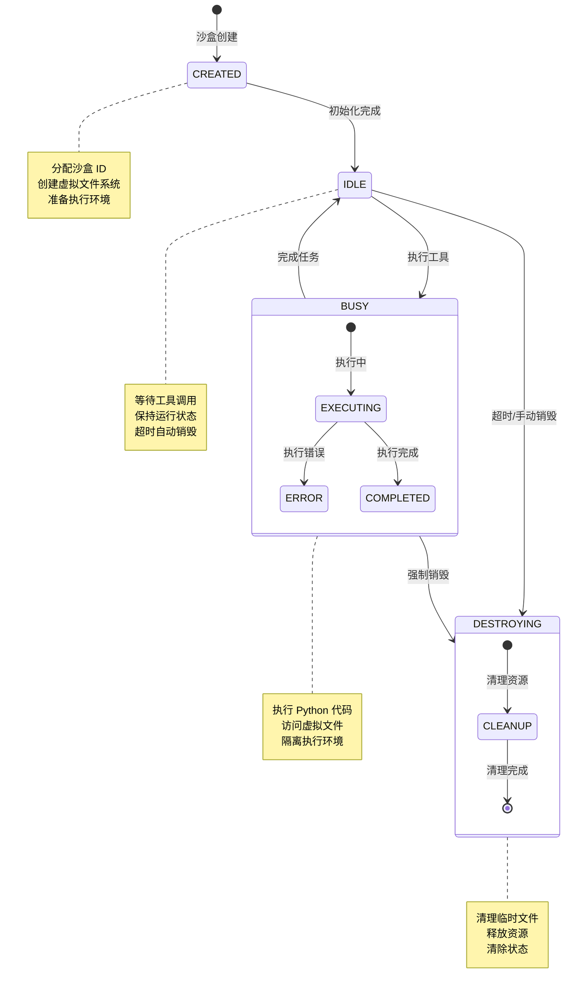
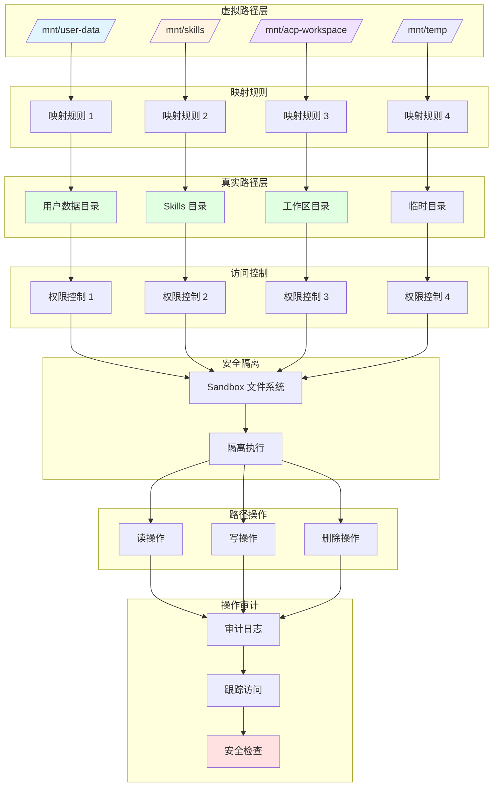
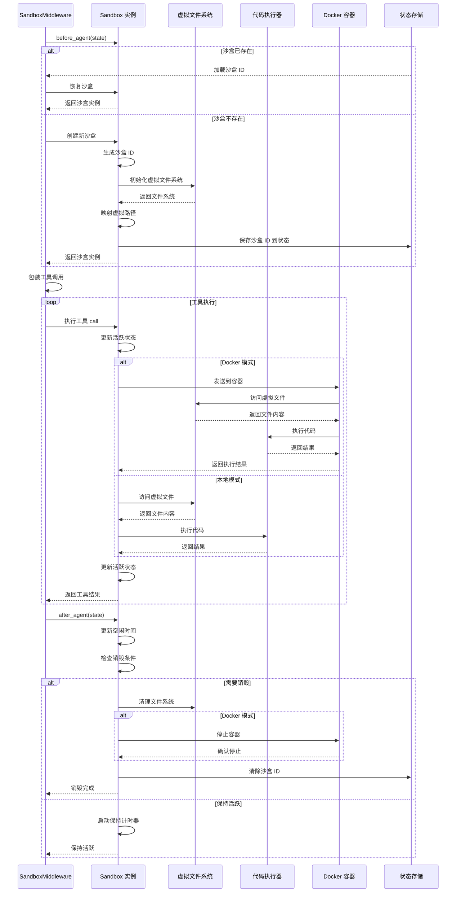
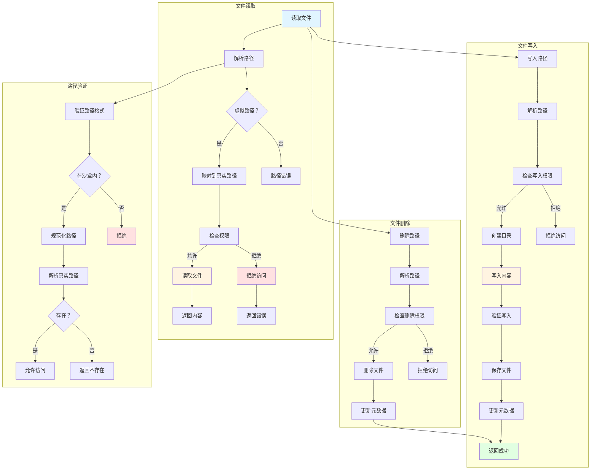
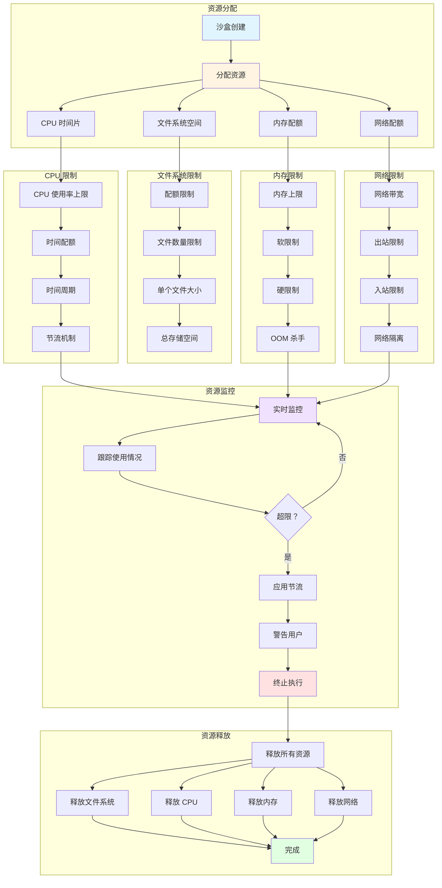

# DeerFlow Sandbox 执行流程图

本文档包含 Sandbox 沙盒系统的完整 Mermaid 流程图，展示沙盒的初始化、执行、文件系统和资源管理。

## 1. Sandbox 生命周期图

展示 Sandbox 从创建到销毁的完整生命周期。



## 2. Sandbox 中间件调用图

展示 SandboxMiddleware 在中间件链中的调用流程。

```mermaid
graph TB
    subgraph "Before-Agent 阶段"
        Start[before_agent 钩子] --> CheckSandbox{沙盒已存在？}
        CheckSandbox -->|是 | LoadSandbox[加载已有沙盒]
        CheckSandbox -->|否 | CreateSandbox
    end
    
    subgraph "沙盒创建"
        CreateSandbox[创建沙盒实例] --> GenSandboxID[生成沙盒 ID]
        GenSandboxID --> InitFS[初始化虚拟文件系统]
        InitFS --> MapPaths[映射虚拟路径]
        MapPaths --> CreateContainer{使用 Docker?}
    end
    
    subgraph "Docker 模式"
        CreateContainer -->|是 | InitDocker[初始化 Docker 容器]
        InitDocker --> MountVolumes[挂载卷]
        MountVolumes --> StartContainer[启动容器]
        StartContainer --> CopySkills[复制 skills]
        CopySkills --> SaveSandboxID
    end
    
    subgraph "本地模式"
        CreateContainer -->|否 | InitLocal[初始化本地环境]
        InitLocal --> CreateDir[创建临时目录]
        CreateDir --> SetupEnv[设置执行环境]
        SetupEnv --> SaveSandboxID
    end
    
    subgraph "保存状态"
        SaveSandboxID[保存沙盒 ID 到状态] --> WrapTools[包装工具]
        WrapTools --> ReturnState
    end
    
    subgraph "After-Agent 阶段"
        ReturnState[返回状态] --> after_agent[after_agent 钩子]
        after_agent --> CheckDestroy{需要销毁？}
        CheckDestroy -->|是 | DestroySandbox
        CheckDestroy -->|否 | KeepAlive
    end
    
    subgraph "沙盒销毁"
        DestroySandbox[销毁沙盒] --> CleanupFS[清理文件系统]
        CleanupFS --> CleanupContainer{Docker?}
        CleanupContainer -->|是 | StopContainer[停止容器]
        CleanupContainer -->|否 | CleanupDir[清理目录]
        StopContainer --> ClearState
        CleanupDir --> ClearState
        ClearState[清除状态] --> Done[完成]
    end
    
    subgraph "保持活跃"
        KeepAlive[保持沙盒活跃] --> KeepTimer[启动保持计时器]
        KeepTimer --> IdleCheck{空闲超时？}
        IdleCheck -->|是 | DestroySandbox
        IdleCheck -->|否 | KeepAlive
    end
    
    style Start fill:#e1f5ff
    style Done fill:#e1ffe1
    style CreateSandbox fill:#fff4e1
    style InitDocker fill:#f0e1ff
    style InitLocal fill:#f0e1ff
```



## 3. 虚拟文件系统映射图

展示虚拟路径到真实路径的映射关系。



## 4. Sandbox 执行流程时序图

展示工具调用时 Sandbox 的执行时序。



## 5. Docker 容器管理图

展示 Docker 容器模式下的沙盒管理流程。

```mermaid
graph TB
    subgraph "容器初始化"
        Start[创建 Docker 沙盒] --> CheckDocker{Docker 可用？}
        CheckDocker -->|是 | PullImage[拉取镜像]
        CheckDocker -->|否 | Error[返回错误]
    end
    
    subgraph "容器创建"
        PullImage --> CreateContainer[创建容器]
        CreateContainer --> ConfigContainer[配置容器]
        ConfigContainer --> SetEnv[设置环境变量]
        SetEnv --> SetResources[设置资源限制]
        SetResources --> MountVolumes[挂载卷]
    end
    
    subgraph "卷挂载"
        MountVolumes --> MountUser[/mnt/user-data: 用户目录]
        MountVolumes --> MountSkills[/mnt/skills: skills 目录]
        MountVolumes --> MountWS[/mnt/acp-workspace: 工作区]
        MountVolumes --> MountTemp[/mnt/temp: 临时目录]
    end
    
    subgraph "容器启动"
        MountVolumes --> StartContainer[启动容器]
        StartContainer --> VerifyContainer[验证容器状态]
        VerifyContainer --> CopySkills[复制 skills 到容器]
        CopySkills --> SetupEnv[设置执行环境]
        SetupEnv --> Ready[容器就绪]
    end
    
    subgraph "执行工具"
        Ready --> ExecuteTool[执行工具调用]
        ExecuteTool --> ExecInContainer[在容器内执行]
        ExecInContainer --> AccessFS[访问虚拟文件系统]
        AccessFS --> GetResult[获取执行结果]
    end
    
    subgraph "容器清理"
        GetResult --> CleanupContainer[清理容器]
        CleanupContainer --> StopContainer[停止容器]
        StopContainer --> RemoveContainer[删除容器]
        RemoveContainer --> ClearState[清除状态]
    end
    
    subgraph "资源管理"
        SetResources --> CPU[CPU 限制]
        SetResources --> Memory[内存限制]
        SetResources --> Network[网络隔离]
        SetResources --> Timeout[执行超时]
    end
    
    style Start fill:#e1f5ff
    style Ready fill:#e1ffe1
    style PullImage fill:#fff4e1
    style MountVolumes fill:#f0e1ff
    style StopContainer fill:#ffe1e1
```

## 6. 本地执行环境图

展示本地模式下的沙盒执行环境设置。

```mermaid
graph TB
    subgraph "环境创建"
        Start[创建本地沙盒] --> GenTempDir[生成临时目录]
        GenTempDir --> CreateDir[创建目录结构]
        CreateDir --> SetupIsolation[设置隔离]
    end
    
    subgraph "目录结构"
        SetupIsolation --> DirUser[/mnt/user-data]
        SetupIsolation --> DirSkills[/mnt/skills]
        SetupIsolation --> DirWS[/mnt/acp-workspace]
        SetupIsolation --> DirTemp[/mnt/temp]
        SetupIsolation --> DirWork[工作目录]
    end
    
    subgraph "路径映射"
        DirUser --> MapUser[映射到真实用户目录]
        DirSkills --> MapSkills[映射到真实 skills 目录]
        DirWS --> MapWS[映射到真实工作区]
        DirTemp --> MapTemp[映射到临时目录]
    end
    
    subgraph "环境配置"
        MapTemp --> ConfigEnv[配置执行环境]
        ConfigEnv --> SetPython[设置 Python 路径]
        SetPython --> InstallDeps[安装依赖]
        InstallDeps --> CopySkills[复制 skills]
    end
    
    subgraph "安全隔离"
        CopySkills --> EnableIsolation[启用隔离]
        EnableIsolation --> NetworkIsolate[网络隔离]
        NetworkIsolate --> ResourceLimit[资源限制]
        ResourceLimit --> FileIsolate[文件隔离]
    end
    
    subgraph "执行工具"
        FileIsolate --> ExecuteTool[执行工具]
        ExecuteTool --> RunInWork[在工作目录运行]
        RunInWork --> AccessMapped[访问映射路径]
        AccessMapped --> GetResult[获取执行结果]
    end
    
    subgraph "环境清理"
        GetResult --> CleanupTemp[清理临时目录]
        CleanupTemp --> RemoveDir[删除目录树]
        RemoveDir --> ClearCache[清除缓存]
        ClearCache --> Done[完成]
    end
    
    style Start fill:#e1f5ff
    style Done fill:#e1ffe1
    style CreateDir fill:#fff4e1
    style EnableIsolation fill:#f0e1ff
    style CleanupTemp fill:#ffe1e1
```

## 7. 文件系统操作图

展示 Sandbox 文件系统的读写操作流程。



## 8. 资源管理图

展示 Sandbox 的资源分配和限制管理。



## 图表说明

### 生命周期状态
- **CREATED**: 沙盒已创建，正在初始化
- **IDLE**: 沙盒空闲，等待工具调用
- **BUSY**: 沙盒正在执行工具
- **DESTROYING**: 沙盒正在清理销毁

### 执行模式
1. **Docker 模式**: 使用 Docker 容器提供完全隔离
2. **本地模式**: 使用本地临时目录和隔离机制

### 虚拟路径映射
- `/mnt/user-data/*` → 用户数据目录
- `/mnt/skills/*` → Skills 目录
- `/mnt/acp-workspace/*` → 工作区目录
- `/mnt/temp/*` → 临时目录

### 资源限制
- **CPU**: 使用率上限和时间配额
- **内存**: 软限制和硬限制，OOM 保护
- **文件系统**: 存储空间和文件数量限制
- **网络**: 带宽限制和网络隔离

### 安全特性
1. **路径隔离**: 虚拟路径映射防止越权访问
2. **权限控制**: 读写删除操作都需要权限验证
3. **审计日志**: 所有文件操作都有审计记录
4. **资源隔离**: CPU、内存、网络多重隔离
5. **超时保护**: 执行超时自动终止

### 中间件钩子
- **before_agent**: 初始化或恢复沙盒，包装工具调用
- **after_agent**: 更新空闲时间，检查销毁条件

### 使用场景
- 执行用户提供的 Python 代码
- 运行需要文件系统的工具
- 隔离执行不可信代码
- 提供一致的执行环境
