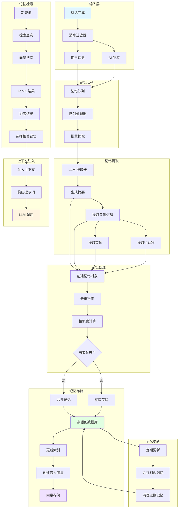
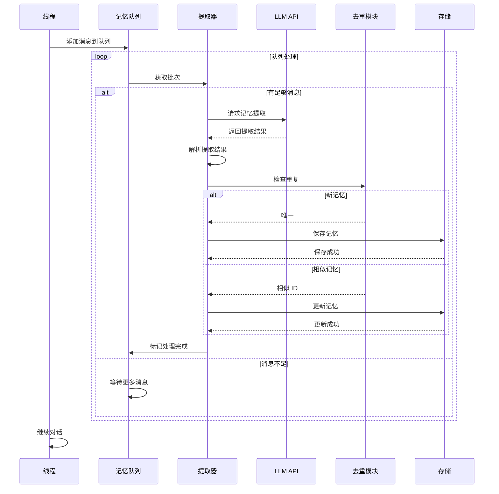
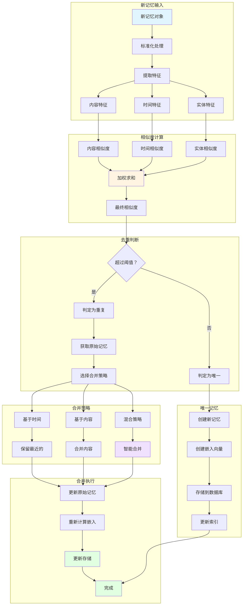
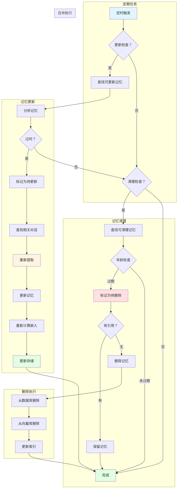
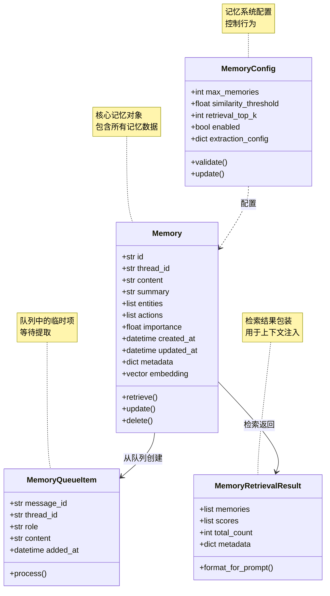
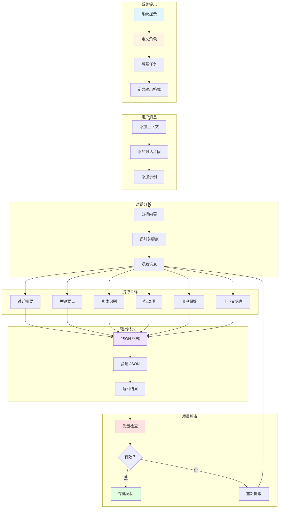
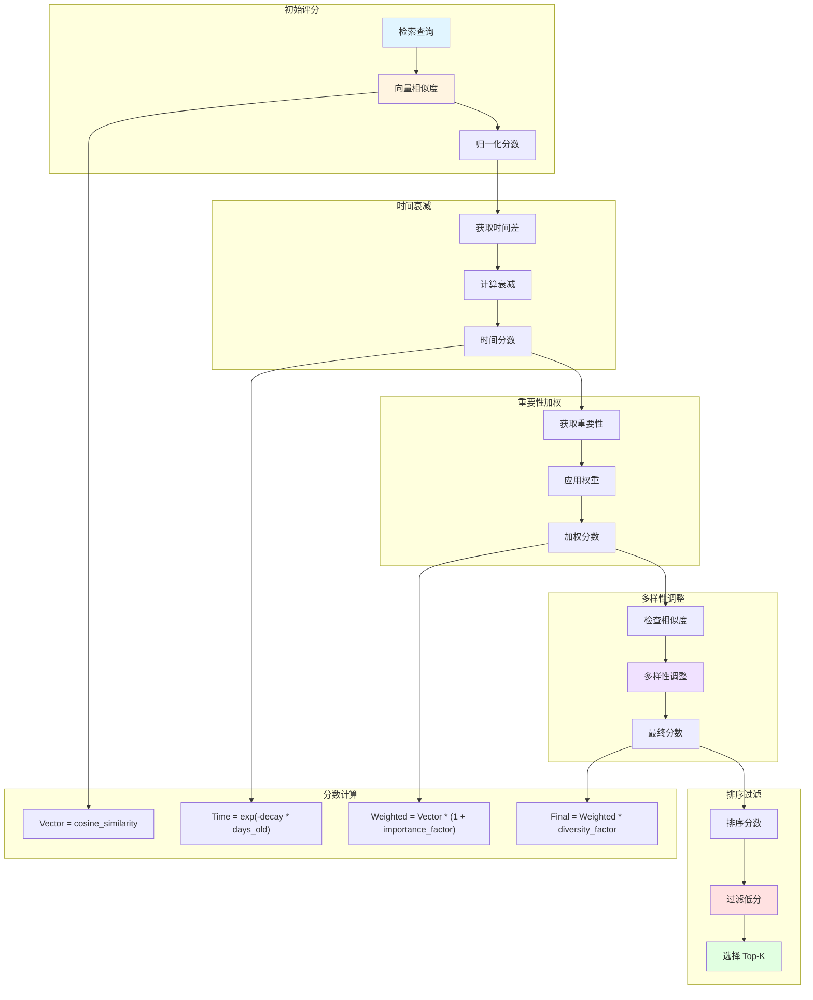

# DeerFlow Memory 系统流程图

本文档包含 Memory 记忆系统的完整 Mermaid 流程图，展示记忆的提取、存储、检索和更新机制。

## 1. Memory 系统架构图

展示 Memory 系统的整体架构和组件关系。

## 2. 记忆提取流程时序图

展示记忆从对话到存储的完整时序。

## 3. 记忆检索与注入图

展示记忆检索和注入到 LLM 上下文的流程。

```mermaid
graph TB
    subgraph "查询准备"
        Start[新线程开始] --> GetContext[获取上下文]
        GetContext --> GetThreadInfo[获取线程信息]
        GetThreadInfo --> GetConfig[获取记忆配置]
        GetConfig --> BuildQuery[构建检索查询]
    end
    
    subgraph "向量检索"
        BuildQuery --> CreateEmbedding[创建查询嵌入]
        CreateEmbedding --> VectorSearch[向量相似度搜索]
        VectorSearch --> SimilarityScore[计算相似度]
        SimilarityScore --> FilterMem[过滤低分记忆]
    end
    
    subgraph "结果排序"
        FilterMem --> RankByRecency[按时间排序]
        RankByRecency --> RankByRelevance[按相关性排序]
        RankByRelevance --> RankByImportance[按重要性排序]
        RankByImportance --> FinalRank[最终排序]
    end
    
    subgraph "记忆选择"
        FinalRank --> SelectTopK[选择 Top-K]
        SelectTopK --> CheckLimit{超过限制？}
        CheckLimit -->|是 | TrimMem[裁剪记忆]
        CheckLimit -->|否 | UseMem[使用记忆]
        
        TrimMem --> UseMem
    end
    
    subgraph "上下文构建"
        UseMem --> FormatMem[格式化记忆]
        FormatMem --> AddMetadata[添加元数据]
        AddMetadata --> BuildPromptSection[构建提示部分]
        BuildPromptSection --> InjectCtx[注入上下文]
    end
    
    subgraph "LLM 调用"
        InjectCtx --> CombinePrompt[组合提示词]
        CombinePrompt --> AddSystem[添加系统提示]
        AddSystem --> AddHistory[添加对话历史]
        AddHistory --> LLMCall[调用 LLM]
        LLMCall --> GenerateResp[生成响应]
    end
    
    style Start fill:#e1f5ff
    style GenerateResp fill:#e1ffe1
    style VectorSearch fill:#fff4e1
    style FinalRank fill:#f0e1ff
    style LLMCall fill:#fff4e1
```

## 4. 记忆去重与合并图

展示记忆去重和相似记忆合并的逻辑。

## 5. 记忆更新与清理图

展示记忆的定期更新和过期清理机制。

## 6. 记忆数据结构图

展示记忆对象的数据结构和字段定义。

## 7. 记忆提取 LLM 提示图

展示用于记忆提取的 LLM 提示结构。

## 8. 记忆检索评分图

展示记忆检索的评分和排序机制。

## 图表说明

### 记忆生命周期
1. **创建**: 从对话消息提取
2. **存储**: 保存到数据库和向量库
3. **检索**: 根据查询检索相关记忆
4. **更新**: 定期更新过时记忆
5. **清理**: 删除过期记忆

### 记忆提取
- **摘要生成**: 生成对话摘要
- **关键信息**: 提取关键点
- **实体识别**: 识别人名、地点、组织等
- **行动项**: 提取待办事项
- **偏好**: 识别用户偏好

### 检索机制
- **向量搜索**: 基于嵌入向量相似度
- **时间衰减**: 旧记忆分数降低
- **重要性加权**: 重要记忆权重增加
- **多样性**: 避免相似记忆重复

### 去重策略
- **相似度阈值**: 超过阈值视为重复
- **时间窗口**: 短时间内的相似记忆
- **内容重叠**: 内容重叠度检查
- **智能合并**: 合并相似记忆内容

### 配置参数
- **max_memories**: 最大记忆数量
- **similarity_threshold**: 去重相似度阈值
- **retrieval_top_k**: 检索 Top-K 数量
- **enabled**: 是否启用记忆
- **extraction_config**: 提取配置

### 数据结构
- **id**: 记忆唯一标识
- **thread_id**: 所属线程
- **content**: 记忆内容
- **summary**: 摘要
- **entities**: 实体列表
- **actions**: 行动项
- **importance**: 重要性分数
- **embedding**: 嵌入向量

### 使用场景
- 跨会话上下文保留
- 用户偏好学习
- 对话历史摘要
- 任务跟踪和提醒
- 个性化响应

### 性能优化
1. **批量处理**: 队列批量提取
2. **异步执行**: 非阻塞提取
3. **向量索引**: 高效相似度搜索
4. **缓存机制**: 减少重复计算
5. **定期清理**: 控制存储大小
