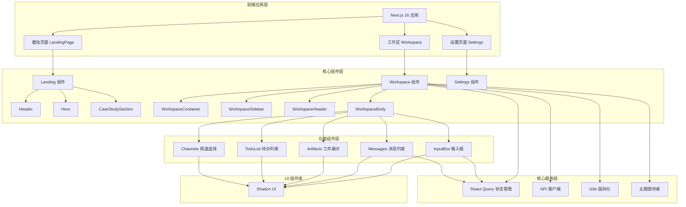
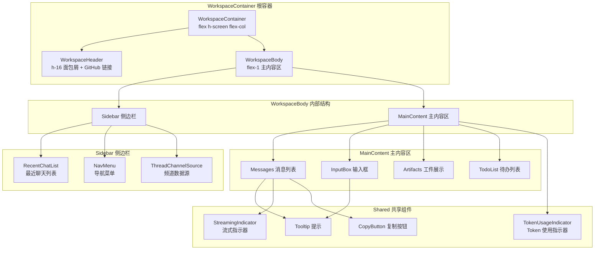
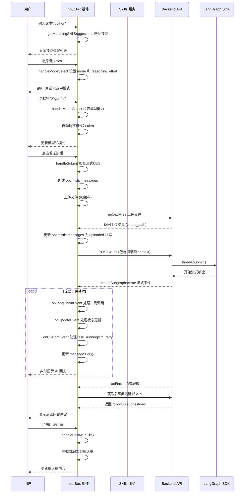
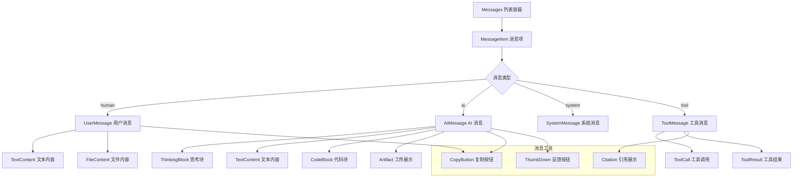
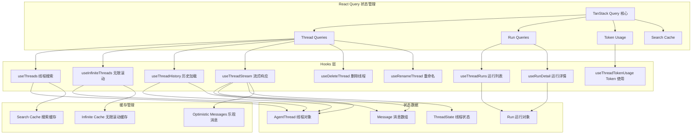
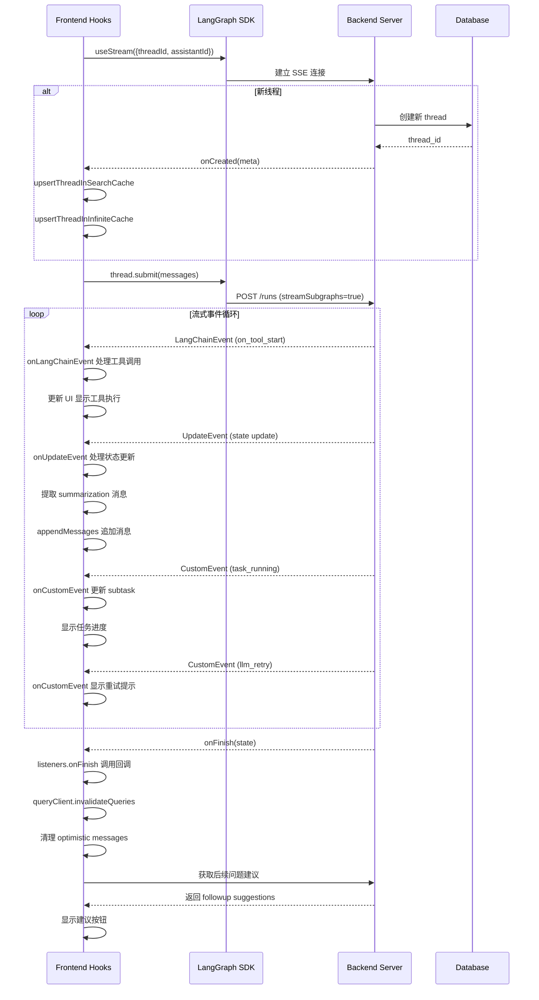
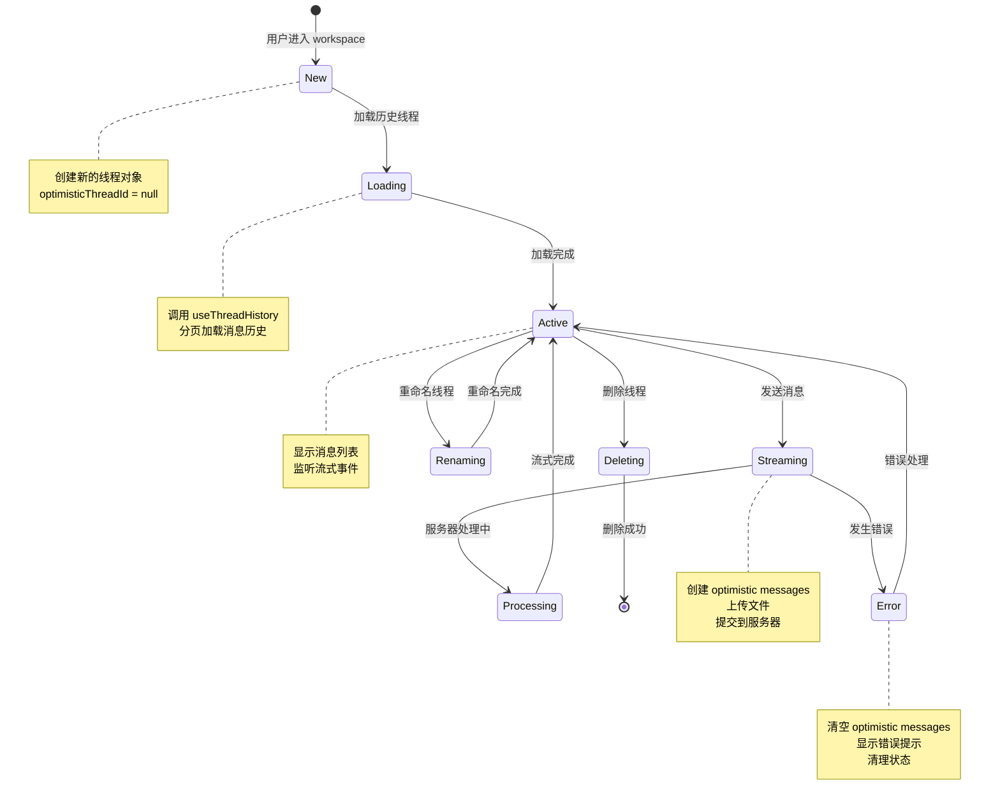
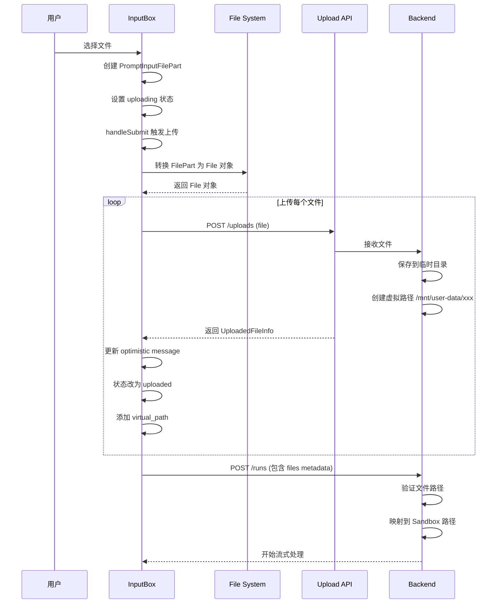
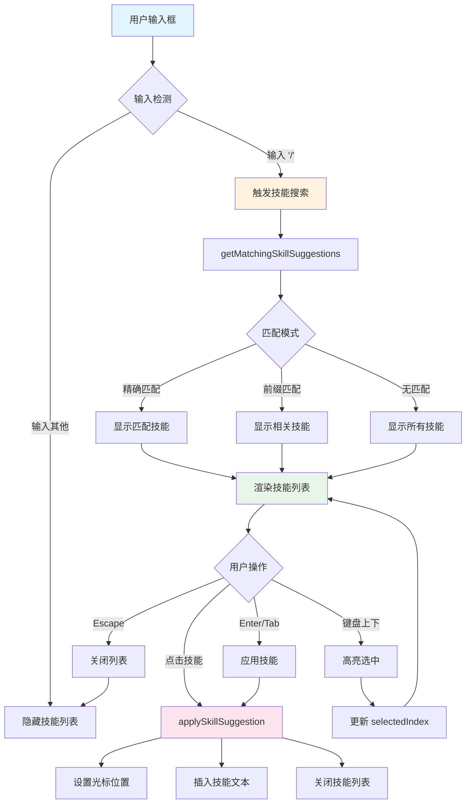
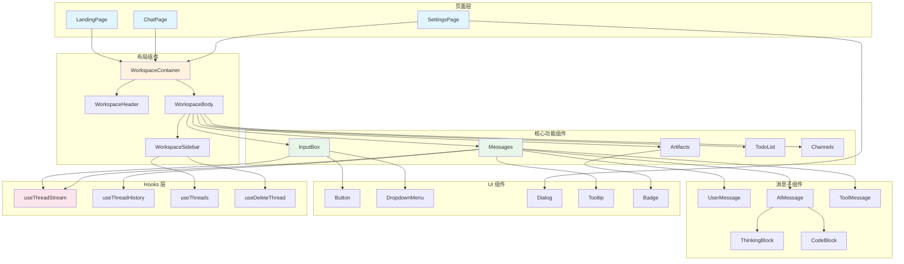

# DeerFlow 前端架构与交互流程图

本文档包含 DeerFlow 前端系统的完整流程图，展示页面路由、组件架构、状态管理和用户交互流程。

---

## 目录

1. [前端整体架构图](#1-前端整体架构图)
2. [页面路由结构图](#2-页面路由结构图)
3. [工作区布局组件图](#3-工作区布局组件图)
4. [输入框组件交互图](#4-输入框组件交互图)
5. [消息渲染组件图](#5-消息渲染组件图)
6. [状态管理架构](#6-状态管理架构)
7. [流式响应处理流程](#7-流式响应处理流程)
8. [线程生命周期管理](#8-线程生命周期管理)
9. [文件上传流程](#9-文件上传流程)
10. [技能建议系统](#10-技能建议系统)
11. [组件依赖关系图](#11-组件依赖关系图)

---

## 1. 前端整体架构图



**图例说明:**
- **前端应用层**: Next.js 16 构建的多页面应用，包含着陆页、工作区和设置页
- **核心组件层**: 各页面的主要布局组件
- **功能组件层**: 工作区内的核心功能组件
- **UI 组件库**: 基于 Shadcn UI 的组件系统
- **核心服务层**: 状态管理、API 调用、国际化等公共服务

---

## 2. 页面路由结构图

```mermaid
graph LR
    A[/] --> B[LandingPage]
    A --> C[Workspace 重定向]
    
    C --> D{是否有历史线程？}
    D -->|是 | E["/workspace/chats/[thread_id]"]
    D -->|否 | F["/workspace/chats?new=true"]
    
    E --> G[ChatPage]
    F --> G
    
    H[/settings] --> I[SettingsPage]
    J[/docs] --> K[DocsPage]
    
    style A fill:#e1f5ff
    style B fill:#fff3e0
    style C fill:#fff3e0
    style D fill:#ffe0b2
    style E fill:#e8f5e9
    style F fill:#e8f5e9
    style G fill:#e8f5e9
    style H fill:#f3e5f5
    style I fill:#f3e5f5
    style J fill:#fce4ec
    style K fill:#fce4ec
```

**路由说明:**

| 路由 | 组件 | 功能 |
|------|------|------|
| `/` | `LandingPage` | 着陆页面，展示产品介绍和案例研究 |
| `/workspace` | 重定向组件 | 根据历史线程重定向到聊天页或新建聊天 |
| `/workspace/chats/[thread_id]` | `ChatPage` | 聊天工作区核心页面 |
| `/workspace/chats?new=true` | `ChatPage` | 新建聊天入口 |
| `/settings` | `SettingsPage` | 用户设置页面 |
| `/docs` | `DocsPage` | 文档页面 |

---

## 3. 工作区布局组件图



**组件职责:**

- **WorkspaceContainer**: 全屏 flex 布局容器，包含 header 和 body
- **WorkspaceHeader**: 顶部导航栏，显示面包屑导航和 GitHub 链接
- **WorkspaceBody**: 主内容区域，分为侧边栏和主内容区
- **Sidebar**: 左侧边栏，显示最近聊天列表和导航菜单
- **MainContent**: 主内容区，包含消息列表、输入框、工件和待办列表

---

## 4. 输入框组件交互图



**关键交互流程:**

1. **技能建议**: 用户输入 `/` 触发技能建议匹配
2. **模式选择**: 支持 flash/thinking/pro/ultra 四种模式
3. **模型选择**: 根据模型能力自动调整模式
4. **消息发送**: 创建乐观消息 → 上传文件 → 提交 API → 流式响应
5. **流式处理**: 实时显示 AI 回复，处理工具调用和状态更新
6. **后续建议**: 流式完成后获取并显示后续问题建议

---

## 5. 消息渲染组件图



**消息类型说明:**

| 消息类型 | 组件 | 功能 |
|----------|------|------|
| human | `UserMessage` | 用户输入的消息，包含文本和文件 |
| ai | `AIMessage` | AI 回复，包含思考块、文本、代码和工件 |
| system | `SystemMessage` | 系统消息，通常隐藏显示 |
| tool | `ToolMessage` | 工具调用结果消息 |

---

## 6. 状态管理架构



**状态管理特点:**

- **React Query**: 使用 TanStack Query 进行服务端状态管理
- **Hooks 分层**: 提供多个专用 hooks 处理不同场景
- **缓存优化**: 搜索缓存和无限滚动缓存协同工作
- **乐观更新**: 在服务器响应前显示乐观消息提升体验

---

## 7. 流式响应处理流程



**流式处理关键点:**

1. **连接建立**: 使用 LangGraph SDK 的 `useStream` Hook 建立 SSE 连接
2. **事件处理**: 处理 LangChainEvent、UpdateEvent、CustomEvent 三种事件
3. **消息合并**: 合并历史消息、流式消息和乐观消息
4. **去重机制**: 基于 `messageIdentity` 进行消息去重
5. **缓存更新**: 流式完成后 invalidation 查询缓存

---

## 8. 线程生命周期管理



**线程状态:**

| 状态 | 描述 | 关键操作 |
|------|------|----------|
| New | 新建线程 | 创建线程对象，准备发送消息 |
| Loading | 加载历史 | 分页加载消息历史 |
| Active | 活跃状态 | 显示消息，监听事件 |
| Streaming | 流式发送 | 上传文件，提交 API |
| Processing | 处理中 | 服务器处理，流式返回 |
| Error | 错误状态 | 错误提示，状态清理 |
| Deleting | 删除中 | 删除线程，清理缓存 |
| Renaming | 重命名中 | 更新线程标题 |

---

## 9. 文件上传流程



**文件上传步骤:**

1. **选择文件**: 用户选择文件，创建 `PromptInputFilePart`
2. **转换文件**: 将 FilePart 转换为浏览器 File 对象
3. **上传文件**: 调用 Upload API，返回 `UploadedFileInfo`
4. **更新状态**: 将文件状态从 `uploading` 改为 `uploaded`
5. **提交消息**: 将文件 metadata 包含在消息中提交
6. **后端处理**: 后端验证并映射到 Sandbox 虚拟路径

---

## 10. 技能建议系统



**技能建议功能:**

- **触发机制**: 输入 `/` 触发技能搜索
- **匹配模式**: 支持精确匹配、前缀匹配和全量显示
- **键盘导航**: 支持上下箭头选择，Enter/Tab 应用，Escape 关闭
- **光标定位**: 应用技能后自动定位光标到合适位置
- **实时过滤**: 根据输入实时过滤技能列表

---

## 11. 组件依赖关系图



**组件依赖说明:**

- **页面层**: 顶层页面组件，作为应用入口
- **布局组件**: 提供整体布局结构
- **核心功能组件**: 工作区的核心功能实现
- **消息子组件**: 消息类型的细分组件
- **UI 组件**: 基础 UI 组件库
- **Hooks 层**: 状态管理和数据获取

---

## 技术栈总结

| 层级 | 技术 | 版本 |
|------|------|------|
| 框架 | Next.js | 16 |
| 运行时 | React | 19 |
| 样式 | Tailwind CSS | 4 |
| UI 组件 | Shadcn UI | 最新 |
| 状态管理 | TanStack Query | 最新 |
| 语言 | TypeScript | 最新 |
| 国际化 | next-intl | 最新 |
| 客户端 | LangGraph SDK | 最新 |

---

## 关键设计模式

1. **乐观更新模式**: 在服务器响应前显示用户输入
2. **消息去重机制**: 基于 `messageIdentity` 的唯一性识别
3. **流式响应处理**: 使用 LangGraph SDK 的 `useStream` Hook
4. **无限滚动加载**: 使用 React Query 的无限查询
5. **技能建议系统**: 基于输入触发的实时建议
6. **文件上传优化**: 上传前显示乐观状态，完成后更新路径
