# DeerFlow 前端架构与组件交互

本文档包含 DeerFlow 前端系统的完整流程图，展示页面路由、组件交互、状态管理等核心机制。

## 1. 前端整体架构

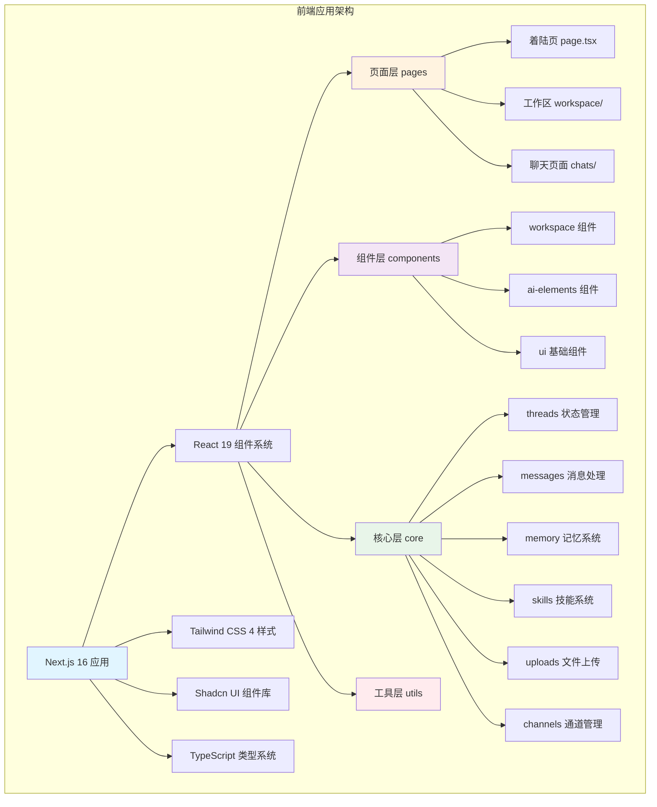

## 2. 页面路由结构

```mermaid
graph TB
    subgraph "Next.js 路由系统"
        A[应用入口] --> B[/page.tsx - 着陆页]
        A --> C[/workspace - 工作区重定向]
        A --> D["/workspace/chats/[thread_id] - 聊天页面"]
        
        B --> B1[LandingPage 组件]
        B --> B2[Header 头部]
        B --> B3[Hero 展示区]
        B --> B4[CaseStudySection 案例]
        B --> B5[FeaturesSection 特性]
        B --> B6[Footer 页脚]
        
        C --> C1[静态重定向逻辑]
        C1 --> C2[有线程？跳转到第一个]
        C1 --> C3[无线程？新建聊天]
        
        D --> D1[WorkspaceContainer 容器]
        D --> D2[useThreadStream Hook]
        D --> D3[流式响应处理]
        
        style A fill:#e1f5ff
        style B fill:#fff3e0
        style C fill:#f3e5f5
        style D fill:#e8f5e9
    end
```

## 3. 工作区布局结构

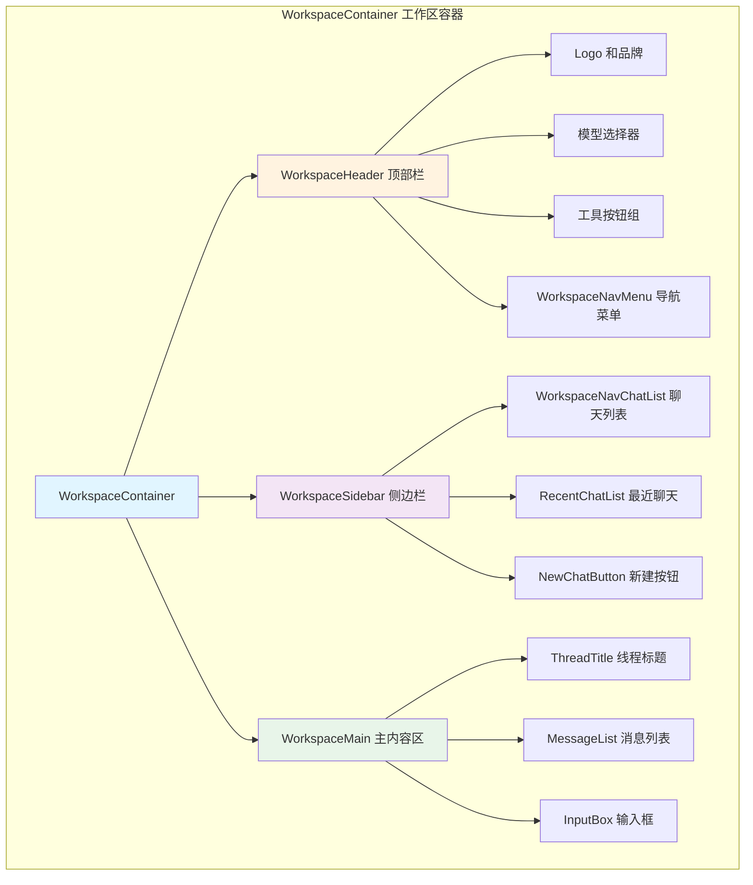

## 4. 输入框组件交互流程

```mermaid
graph TB
    subgraph "InputBox 输入框组件"
        A[InputBox 组件] --> B[用户输入处理]
        A --> C[模式选择]
        A --> D[模型选择]
        A --> E[技能建议]
        
        B --> B1[handleSubmit 提交处理]
        B1 --> B2[检查流式状态]
        B2 --> B3[文件上传检查]
        B3 --> B4[调用 sendMessage]
        
        C --> C1[四种模式：flash/thinking/pro/ultra]
        C1 --> C2[handleModeSelect]
        C2 --> C3[关联 reasoning_effort]
        
        D --> D1[handleModelSelect]
        D1 --> D2[自动调整模式]
        D2 --> D3[同步模型能力]
        
        E --> E1[/ 触发技能搜索]
        E1 --> E2[getMatchingSkillSuggestions]
        E2 --> E3[显示技能建议列表]
        E3 --> E4[键盘导航：上下箭头/Enter/Tab/Esc]
        
        style A fill:#e1f5ff
        style B fill:#fff3e0
        style C fill:#f3e5f5
        style D fill:#e8f5e9
        style E fill:#ffebee
    end
```

## 5. 技能建议系统

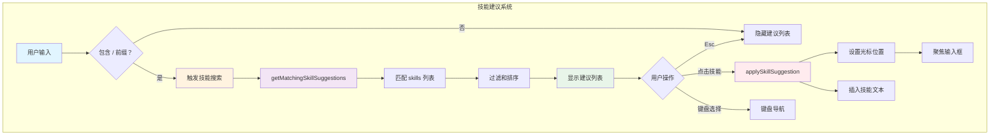

## 6. 状态管理架构（React Query）

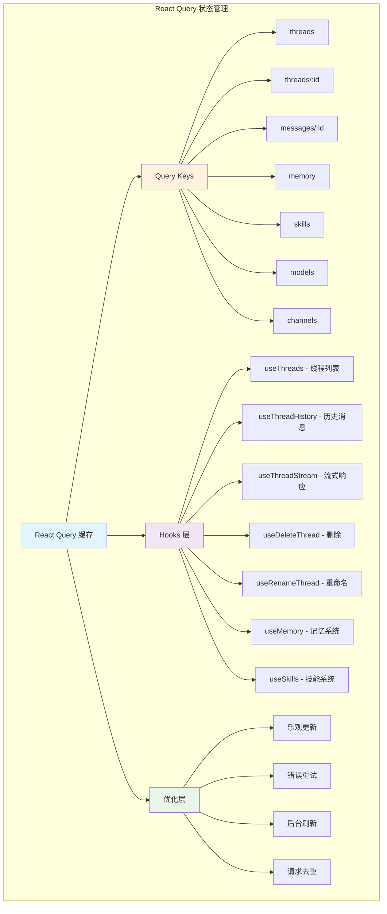

## 7. 消息去重与合并机制

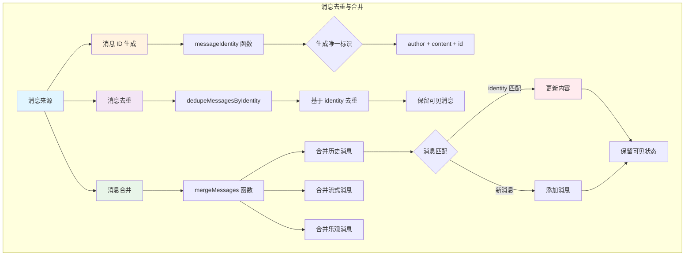

## 8. 流式响应处理流程

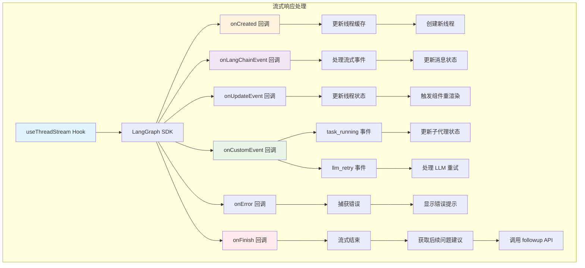

## 9. 消息发送流程

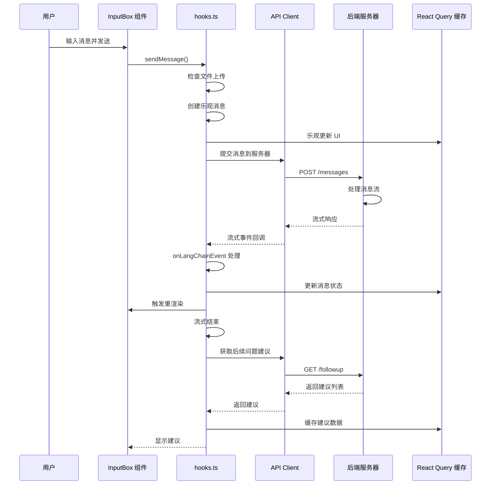

## 10. 线程列表管理

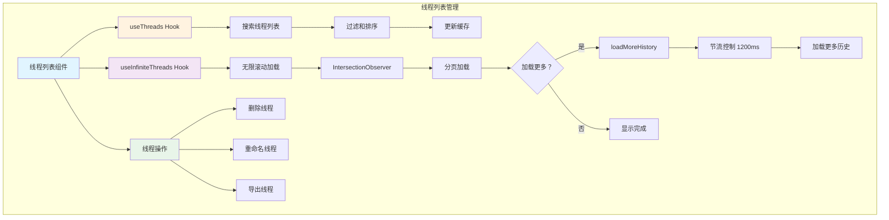

## 11. 命令面板系统

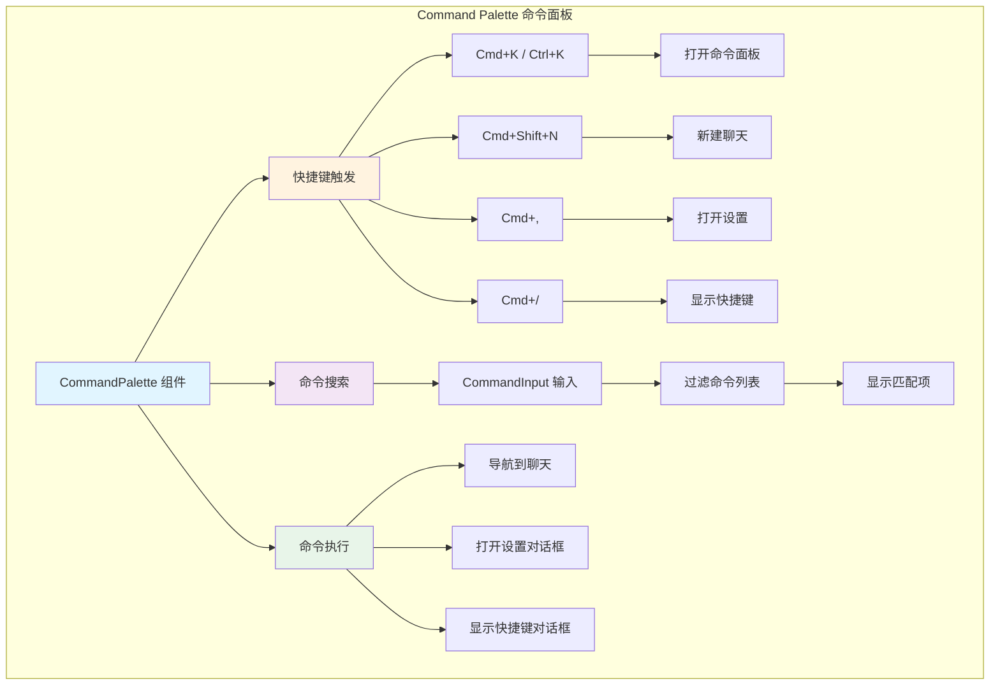

## 12. 消息分组与渲染

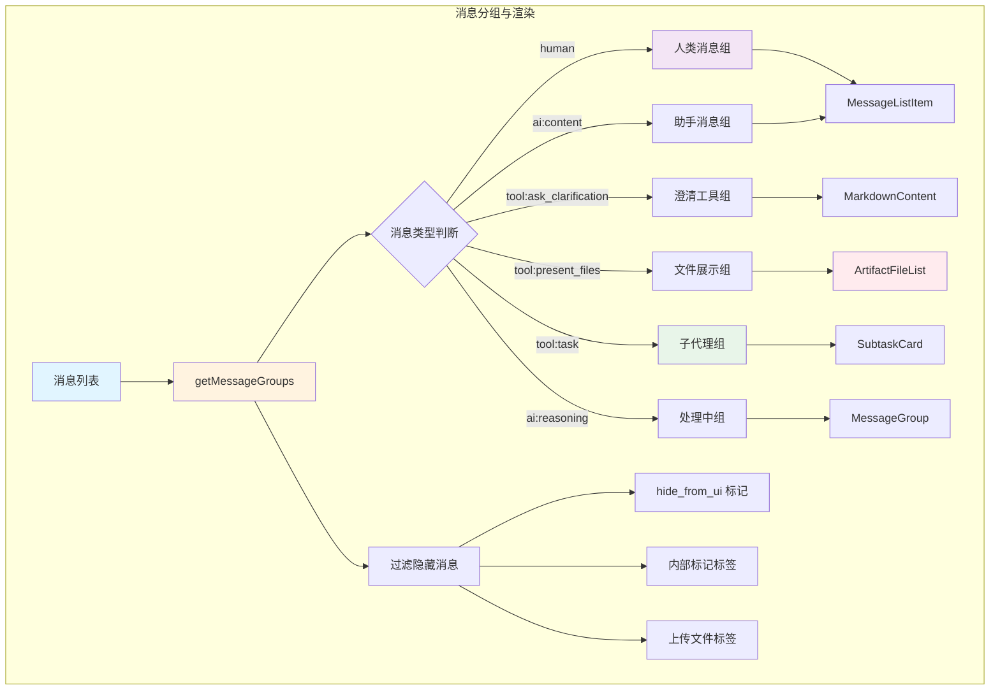

## 13. 组件层级关系

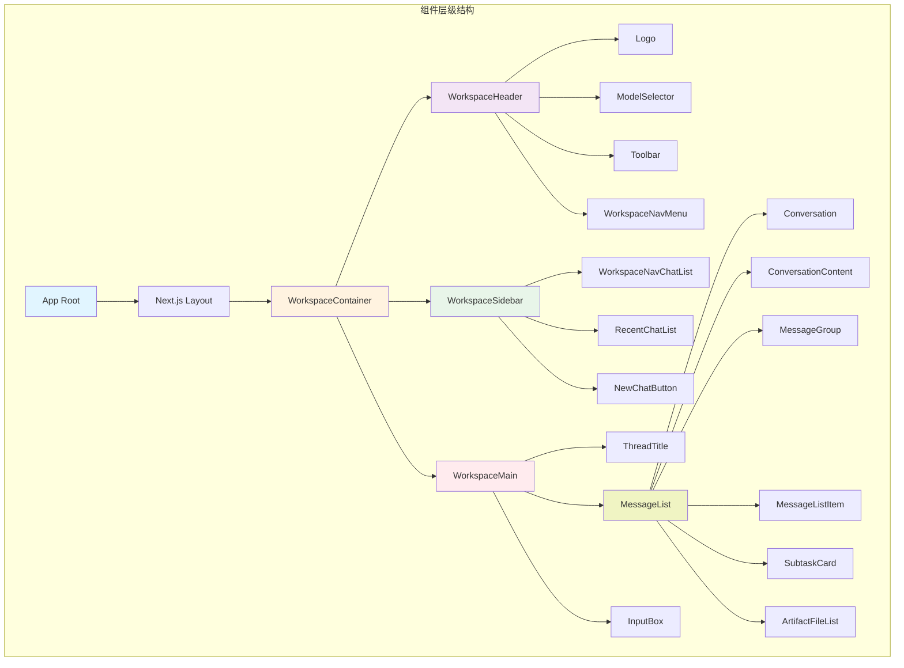

## 14. API 通信架构

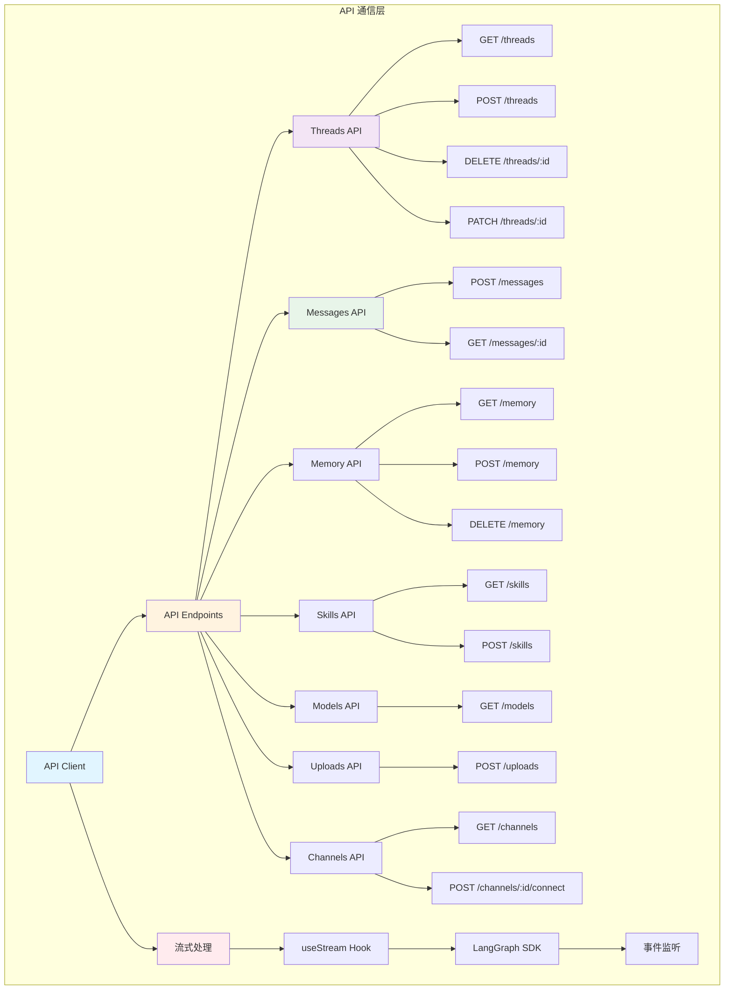

## 15. 错误处理流程

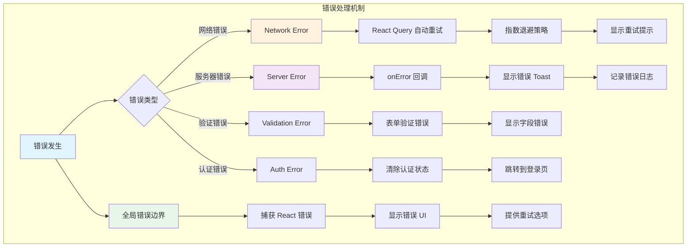

---

**文档说明**：
- 本文档完整展示了 DeerFlow 前端架构的各个关键方面
- 所有流程图均使用 Mermaid 语法编写，可在支持 Mermaid 的 Markdown 查看器中渲染
- 重点展示了 React Query 状态管理、流式响应处理、消息去重合并等核心机制
- 组件层级关系清晰展示了从 App Root 到具体 UI 组件的完整调用链
