# DeerFlow 配置与技能系统流程图

本文档包含 DeerFlow 项目的配置系统、技能系统、工具系统、上传系统、频道系统、模型系统、消息处理系统、认证授权系统、监控日志系统、部署架构等补充流程图。

---

## 1. 配置系统架构

### 1.1 配置加载流程

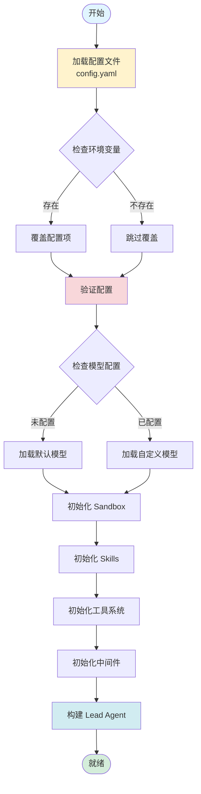

### 1.2 配置结构

```mermaid
graph TB
    Config[配置根节点]
    
    Config --> Server[服务器配置]
    Config --> Model[模型配置]
    Config --> Sandbox[Sandbox 配置]
    Config --> Skills[Skills 配置]
    Config --> Tools[工具配置]
    Config --> Middleware[中间件配置]
    Config --> Memory[记忆配置]
    Config --> Upload[上传配置]
    Config --> Features[功能特性]
    
    Server --> ServerHost[主机地址]
    Server --> ServerPort[端口]
    Server --> ServerWorkers[工作进程数]
    
    Model --> DefaultModel[默认模型]
    Model --> ModelList[模型列表]
    Model --> ProviderConfig[提供商配置]
    
    Sandbox --> SandboxMode[Sandbox 模式<br/>docker/local]
    Sandbox --> SandboxImage[Docker 镜像]
    Sandbox --> SandboxTimeout[超时设置]
    
    Skills --> SkillList[技能列表]
    Skills --> SkillAutoLoad[自动加载策略]
    
    Tools --> ToolList[工具列表]
    Tools --> ToolTimeout[工具超时]
    
    Middleware --> MiddlewareChain[中间件链顺序]
    Middleware --> MiddlewareConfig[各中间件配置]
    
    Memory --> MemoryEnabled[记忆启用]
    Memory --> MemoryRetention[记忆保留期]
    
    Upload --> UploadDir[上传目录]
    Upload --> UploadMaxSize[最大文件大小]
    
    Features --> FeatureFlags[功能标志]
    Features --> Experimental[实验性功能]
    
    style Config fill:#e1f5ff
    style Server fill:#d1ecf1
    style Model fill:#d1ecf1
    style Sandbox fill:#d1ecf1
    style Skills fill:#d1ecf1
    style Tools fill:#d1ecf1
    style Middleware fill:#d1ecf1
    style Memory fill:#d1ecf1
    style Upload fill:#d1ecf1
    style Features fill:#d1ecf1
```

### 1.3 配置热重载

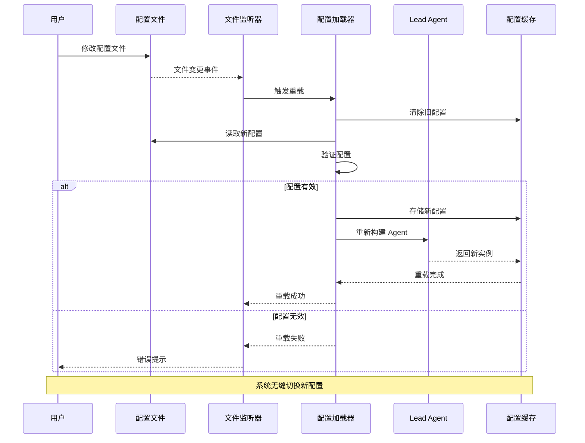

---

## 2. Skills 系统

### 2.1 Skills 加载机制

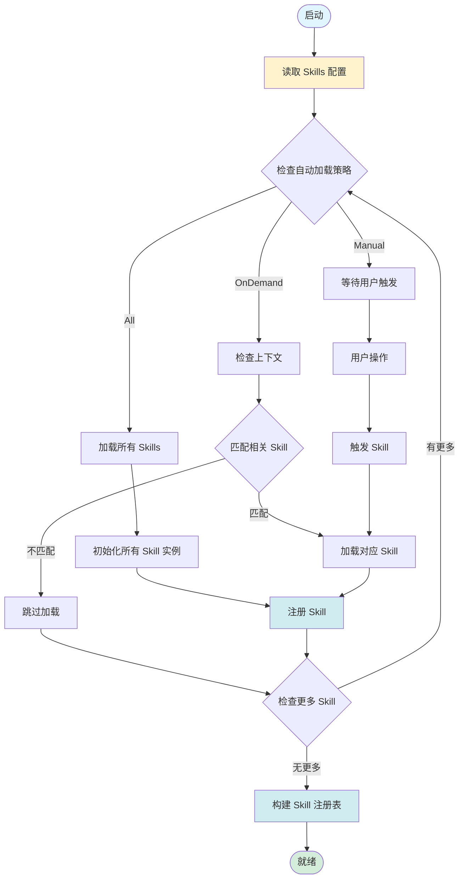

### 2.2 Skill 发现与匹配

```mermaid
graph LR
    Input[用户输入] --> ParseInput[解析输入]
    ParseInput --> ExtractIntent[提取意图]
    ExtractIntent --> SearchSkills[搜索相关 Skills]
    
    SearchSkills --> MatchName{名称匹配}
    MatchName -->|精确 | ScoreSkill[评分]
    MatchName -->|模糊 | SemanticMatch[语义匹配]
    SemanticMatch --> ScoreSkill
    
    ScoreSkill --> CheckContext{上下文匹配}
    CheckContext -->|满足 | CheckPermissions{权限检查}
    CheckContext -->|不满足 | SkipSkill[跳过]
    
    CheckPermissions -->|允许 | AddToPool[加入候选池]
    CheckPermissions -->|拒绝 | SkipSkill
    
    AddToPool --> SortSkills[排序 Skills]
    SortSkills --> SelectTop[选择 Top Skills]
    SelectTop --> InjectToContext[注入到上下文]
    InjectToContext --> Ready([就绪])
    
    style Input fill:#e1f5ff
    style Ready fill:#d4edda
    style SearchSkills fill:#fff3cd
    style ScoreSkill fill:#d1ecf1
    style SelectTop fill:#d4edda
```

### 2.3 Skill 生命周期

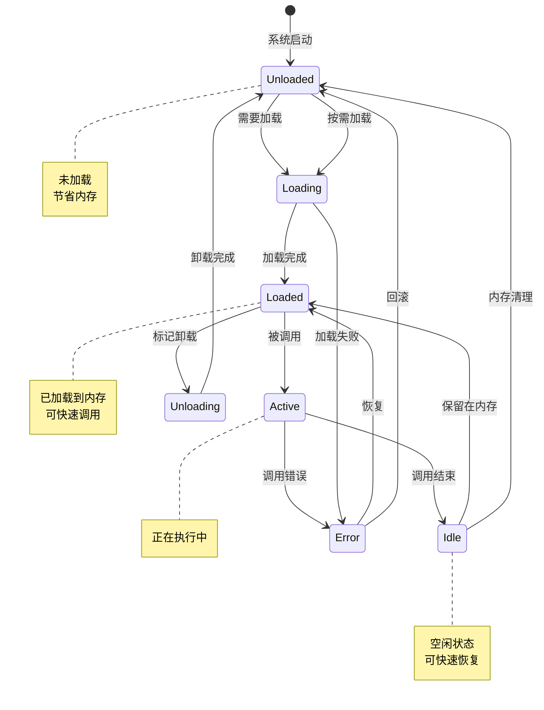

### 2.4 Skill 注册与发现

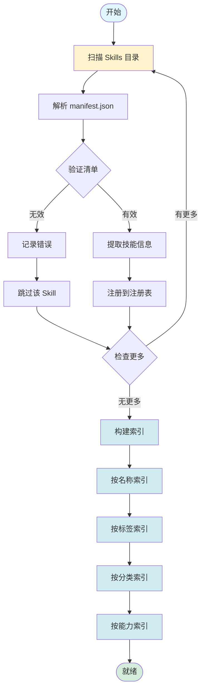

---

## 3. 工具系统

### 3.1 工具注册与发现

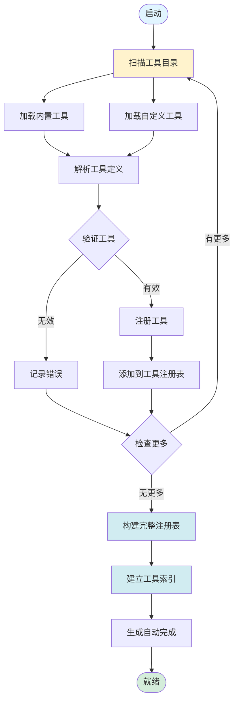

### 3.2 工具调用流程

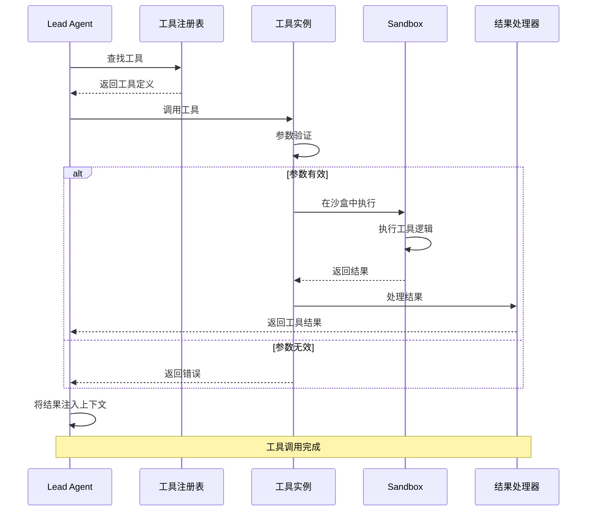

### 3.3 工具错误处理

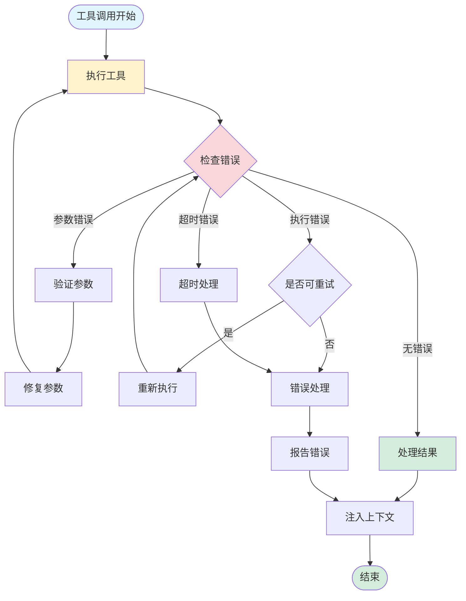

---

## 4. 上传系统

### 4.1 文件上传流程

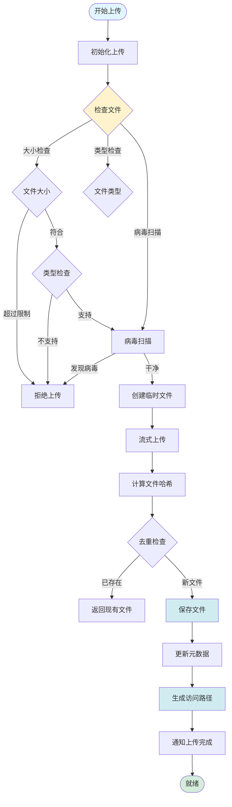

### 4.2 虚拟文件系统

```mermaid
graph TB
    VirtualFS[虚拟文件系统]
    
    VirtualFS --> MntUserdata[/mnt/user-data]
    VirtualFS --> MntSkills[/mnt/skills]
    VirtualFS --> MntWorkspace[/mnt/acp-workspace]
    
    MntUserdata --> UserFiles[用户文件]
    MntUserdata --> Uploads[上传目录]
    
    MntSkills --> SkillFiles[Skill 文件]
    MntSkills --> Templates[模板文件]
    
    MntWorkspace --> ProjectFiles[项目文件]
    MntWorkspace --> Cache[缓存文件]
    
    UserFiles --> MapPath[路径映射]
    Uploads --> MapPath
    SkillFiles --> MapPath
    Templates --> MapPath
    ProjectFiles --> MapPath
    Cache --> MapPath
    
    MapPath --> RealFS[真实文件系统]
    
    style VirtualFS fill:#e1f5ff
    style MntUserdata fill:#d1ecf1
    style MntSkills fill:#d1ecf1
    style MntWorkspace fill:#d1ecf1
    style RealFS fill:#d4edda
```

---

## 5. 频道系统

### 5.1 频道创建与管理

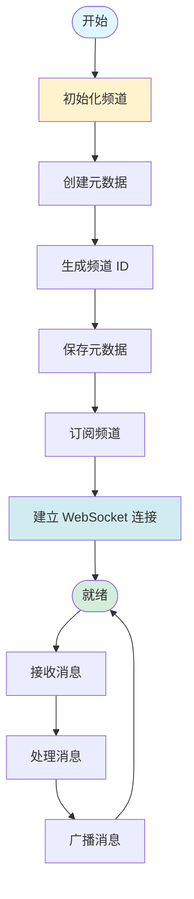

### 5.2 频道消息流转

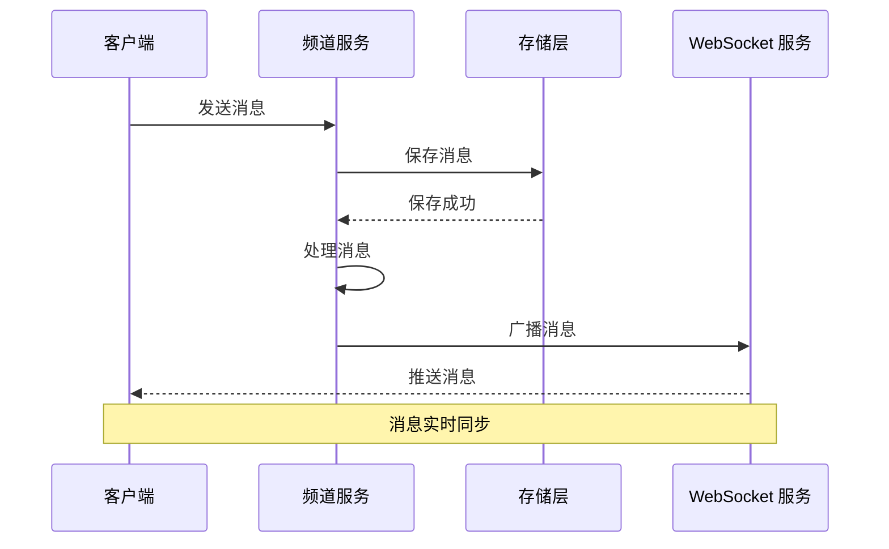

---

## 6. 模型系统

### 6.1 模型选择流程

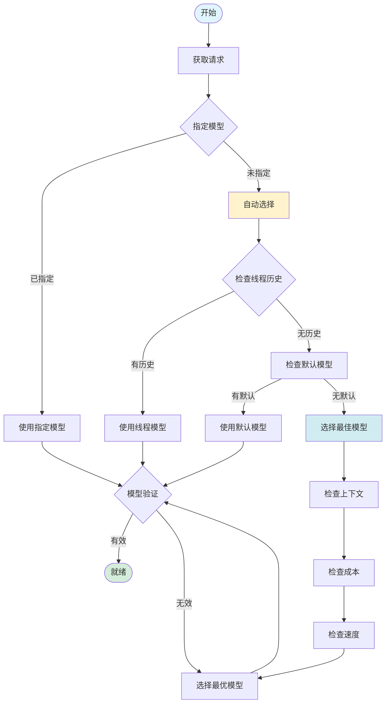

### 6.2 模型路由

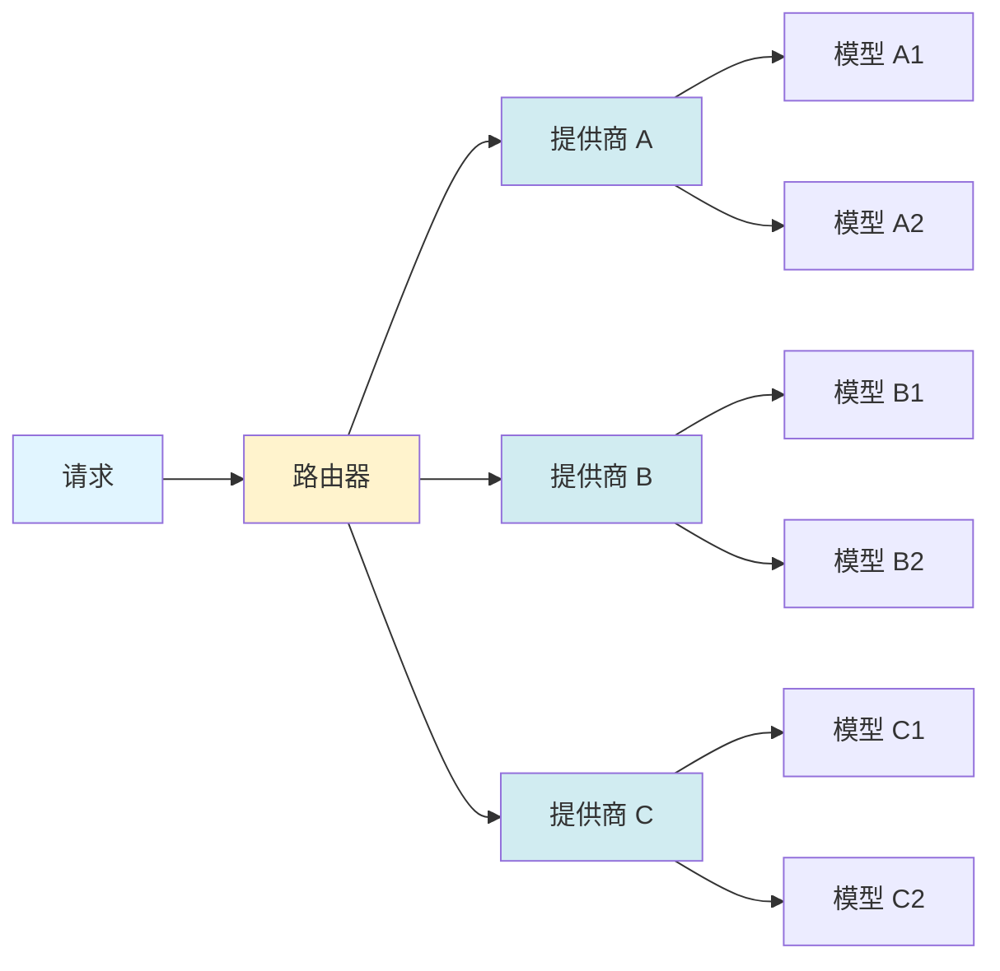

---

## 7. 消息处理系统

### 7.1 消息处理流程

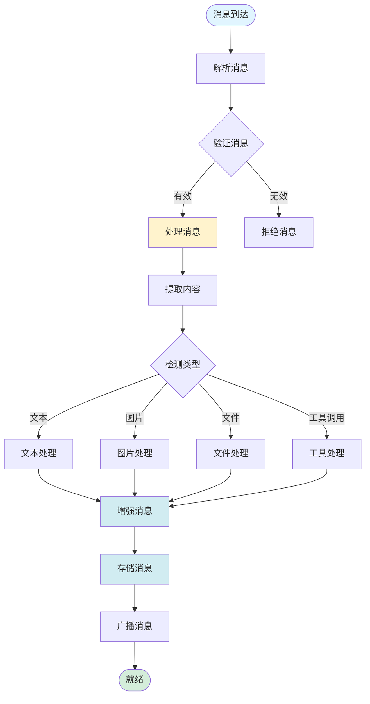

### 7.2 消息去重与合并

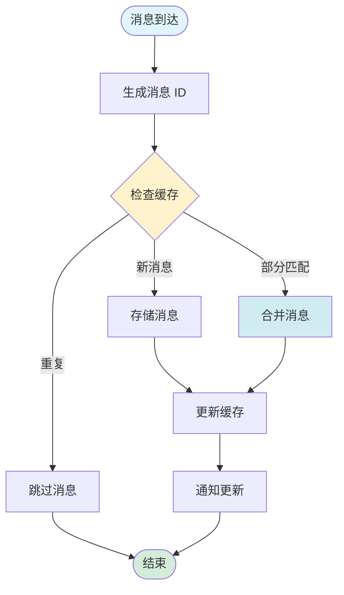

---

## 8. 认证与授权系统

### 8.1 认证流程

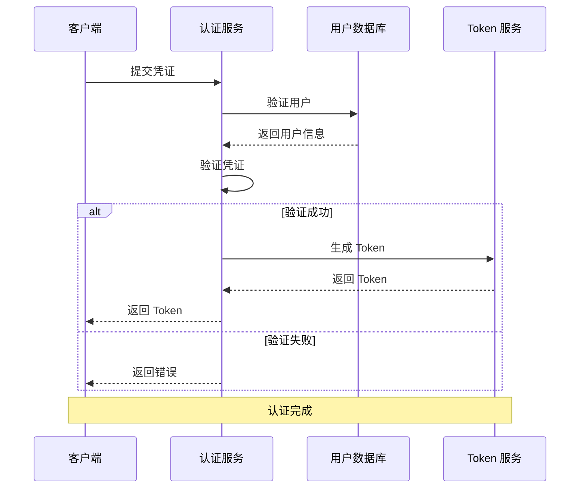

### 8.2 授权流程

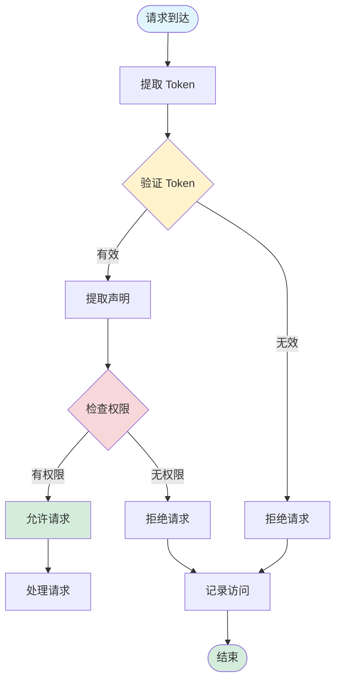

---

## 9. 监控与日志系统

### 9.1 日志收集流程

```mermaid
graph TB
    Start([服务运行]) --> GenerateLog[生成日志]
    GenerateLog --> FormatLog[格式化日志]
    FormatLog --> TagLog[添加标签]
    TagLog --> RouteLog{路由日志}
    
    RouteLog -->|错误 | ErrorLog[错误日志]
    RouteLog -->|警告 | WarnLog[警告日志]
    RouteLog -->|信息 | InfoLog[信息日志]
    RouteLog -->|调试 | DebugLog[调试日志]
    
    ErrorLog --> StoreLog[存储日志]
    WarnLog --> StoreLog
    InfoLog --> StoreLog
    DebugLog --> StoreLog
    
    StoreLog --> IndexLog[索引日志]
    IndexLog --> Ready([就绪])
    
    style Start fill:#e1f5ff
    style Ready fill:#d4edda
    style GenerateLog fill:#fff3cd
    style RouteLog fill:#f8d7da
    style StoreLog fill:#d1ecf1
```

### 9.2 监控指标收集

```mermaid
graph LR
    Collector[监控收集器]
    
    Collector --> MetricA[请求指标]
    Collector --> MetricB[延迟指标]
    Collector --> MetricC[错误指标]
    Collector --> MetricD[资源指标]
    
    MetricA --> StoreMetrics[存储指标]
    MetricB --> StoreMetrics
    MetricC --> StoreMetrics
    MetricD --> StoreMetrics
    
    StoreMetrics --> Dashboard[监控面板]
    StoreMetrics --> Alerting[告警系统]
    
    style Collector fill:#e1f5ff
    style StoreMetrics fill:#d1ecf1
    style Dashboard fill:#d4edda
    style Alerting fill:#fff3cd
```

---

## 10. 部署架构

### 10.1 容器化部署

```mermaid
graph TB
    Docker[Docker 容器]
    
    Docker --> Backend[后端容器]
    Docker --> Frontend[前端容器]
    Docker --> Database[数据库容器]
    Docker --> Cache[缓存容器]
    Docker --> Queue[消息队列容器]
    
    Backend --> API[API 服务]
    Backend --> Worker[后台任务]
    
    Frontend --> Web[Web 服务]
    
    Database --> DBInstance[数据库实例]
    Cache --> CacheInstance[缓存实例]
    Queue --> QueueInstance[队列实例]
    
    LoadBalancer[负载均衡器]
    LoadBalancer --> Backend
    LoadBalancer --> Frontend
    
    style Docker fill:#e1f5ff
    style LoadBalancer fill:#fff3cd
    style Backend fill:#d1ecf1
    style Frontend fill:#d1ecf1
```

### 10.2 云原生部署

```mermaid
graph TB
    Cloud[云平台]
    
    Cloud --> K8s[Kubernetes 集群]
    Cloud --> Serverless[无服务器函数]
    Cloud --> ManagedDB[托管数据库]
    Cloud --> ManagedCache[托管缓存]
    
    K8s --> Namespace[命名空间]
    Namespace --> Deployment[部署]
    Namespace --> Service[服务]
    Namespace --> Ingress[入口]
    
    Deployment --> Pod[Pod]
    Pod --> Container[容器]
    
    Serverless --> Function[函数]
    Function --> Event[事件触发]
    
    ManagedDB --> DBInstance[数据库实例]
    ManagedCache --> CacheInstance[缓存实例]
    
    style Cloud fill:#e1f5ff
    style K8s fill:#d1ecf1
    style Serverless fill:#d1ecf1
    style ManagedDB fill:#d1ecf1
    style ManagedCache fill:#d1ecf1
```

---

## 总结

本章节涵盖了 DeerFlow 项目的补充系统流程图，包括：

1. **配置系统**：配置加载、结构、热重载机制
2. **Skills 系统**：加载机制、发现与匹配、生命周期、注册与发现
3. **工具系统**：注册与发现、调用流程、错误处理
4. **上传系统**：文件上传流程、虚拟文件系统
5. **频道系统**：创建与管理、消息流转
6. **模型系统**：选择流程、路由机制
7. **消息处理系统**：处理流程、去重与合并
8. **认证与授权系统**：认证流程、授权流程
9. **监控与日志系统**：日志收集、指标收集
10. **部署架构**：容器化部署、云原生部署

这些流程图与前面的架构、数据流、核心组件等流程图一起，构成了完整的 DeerFlow 项目文档体系。
