# DeerFlow 高级特性流程图

本文档包含 DeerFlow 项目的高级特性流程图，包括 MCP 协议集成、流式处理、并发控制、性能优化、安全机制、国际化、主题系统、插件扩展、测试策略、CI/CD 等补充流程图。

---

## 1. MCP 协议集成

### 1.1 MCP 连接流程

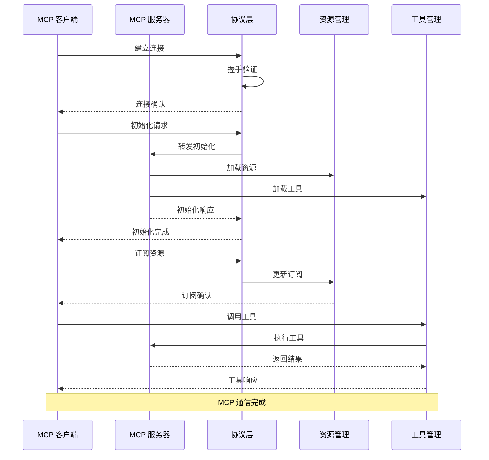

### 1.2 MCP 资源管理

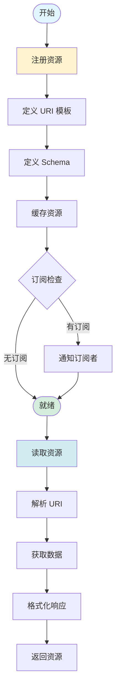

### 1.3 MCP 工具调用

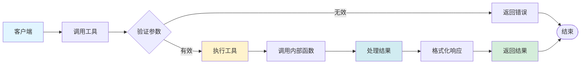

---

## 2. 流式处理系统

### 2.1 流式响应架构

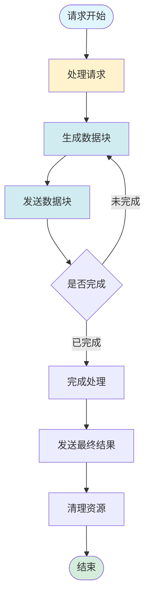

### 2.2 SSE 流式传输

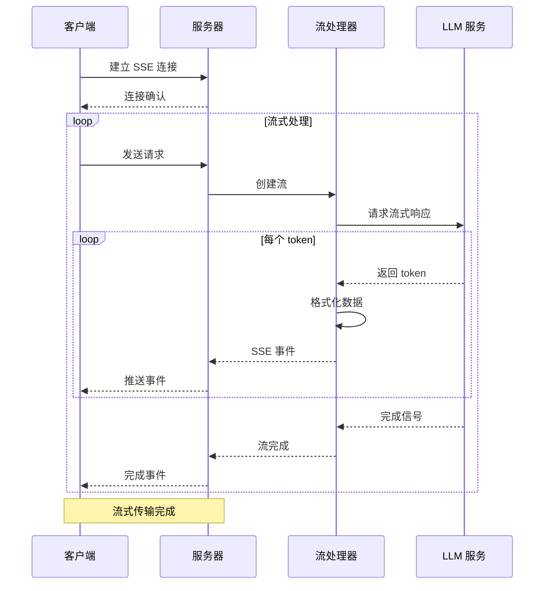

### 2.3 流式状态管理

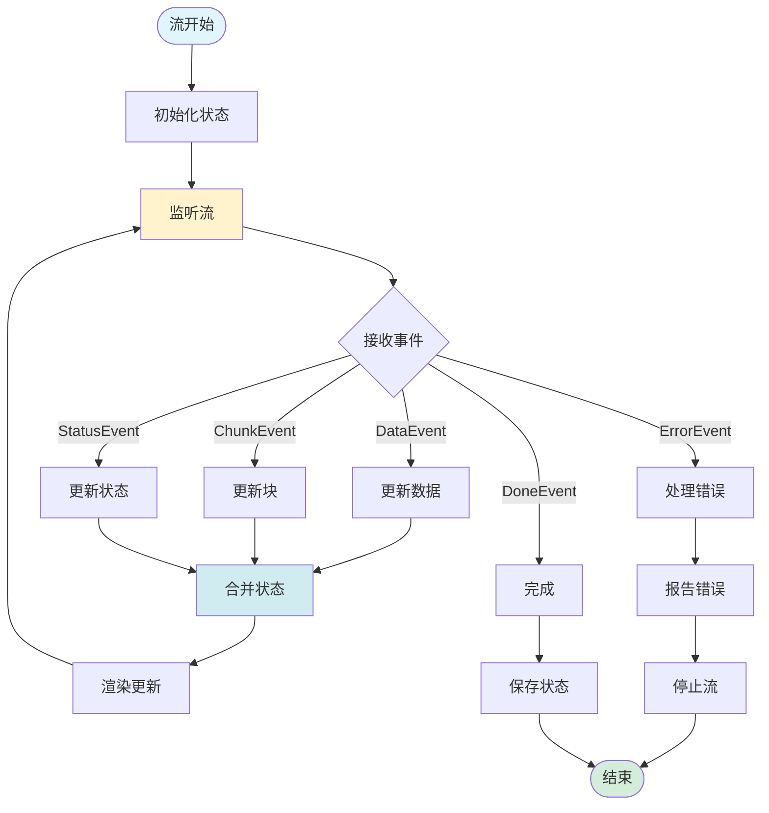

---

## 3. 并发控制系统

### 3.1 并发请求控制

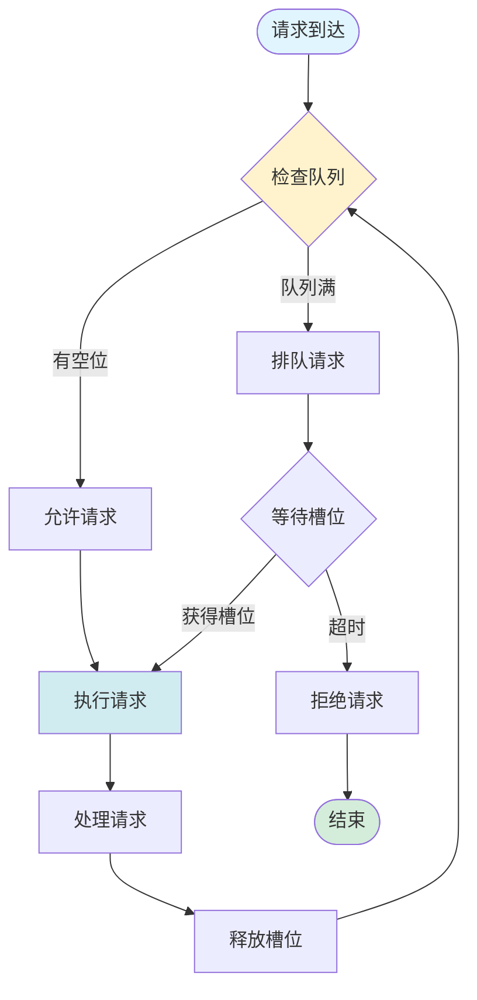

### 3.2 子代理并发控制

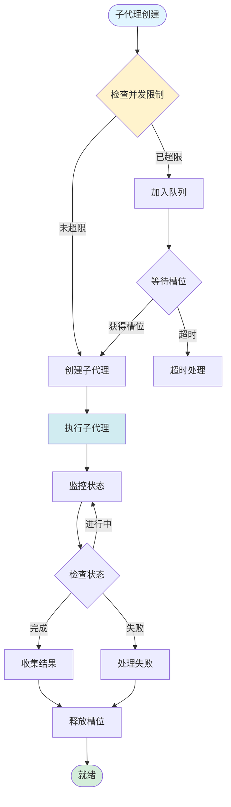

### 3.3 线程池管理

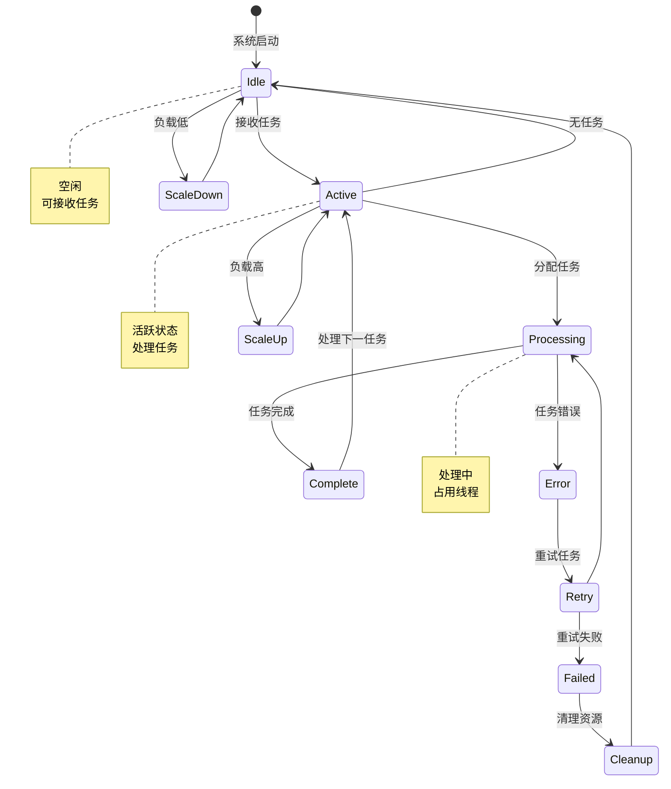

---

## 4. 性能优化系统

### 4.1 缓存策略

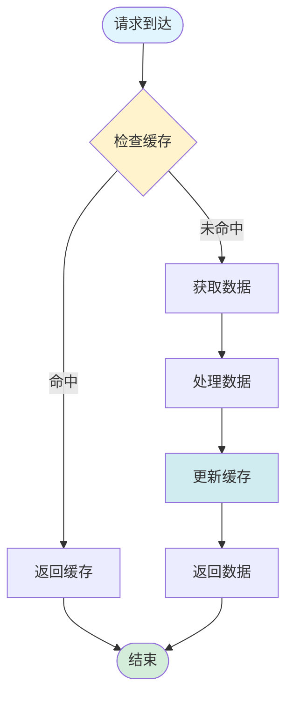

### 4.2 查询优化

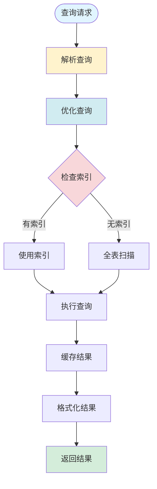

### 4.3 批量处理

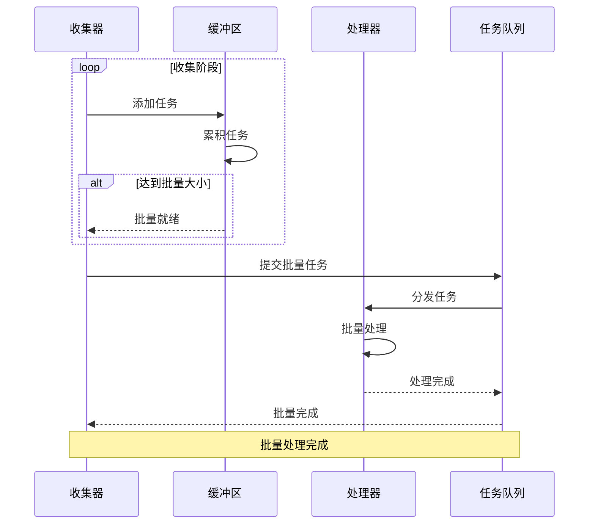

---

## 5. 安全机制

### 5.1 输入验证

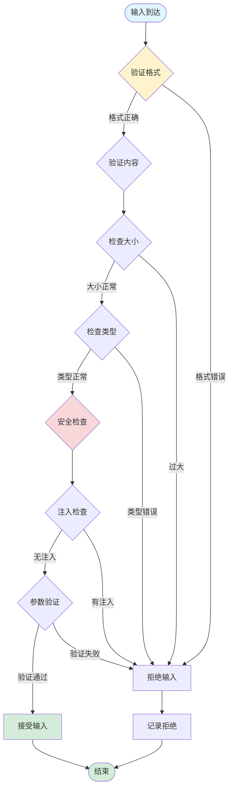

### 5.2 输出过滤

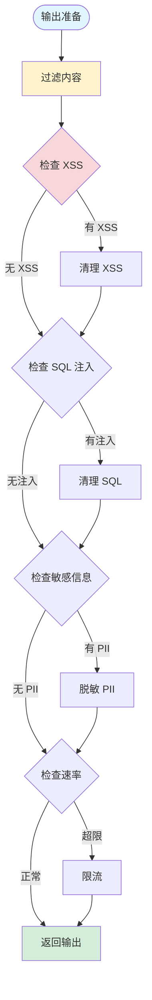

### 5.3 访问控制

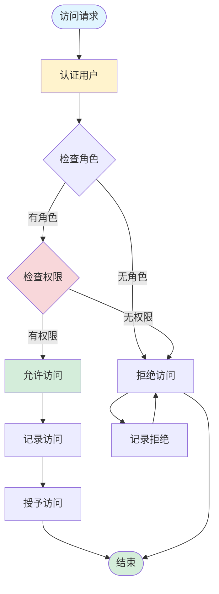

---

## 6. 国际化系统

### 6.1 语言切换流程

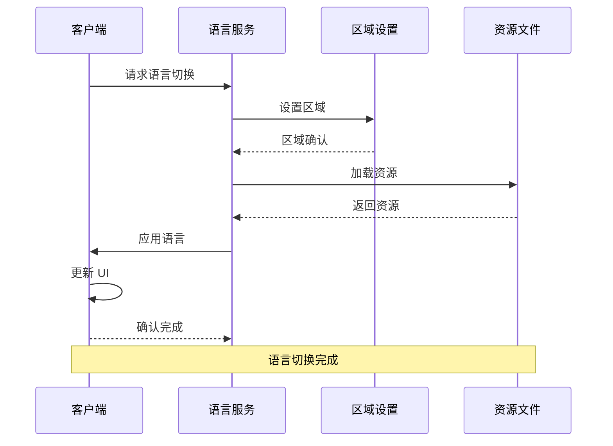

### 6.2 资源加载策略

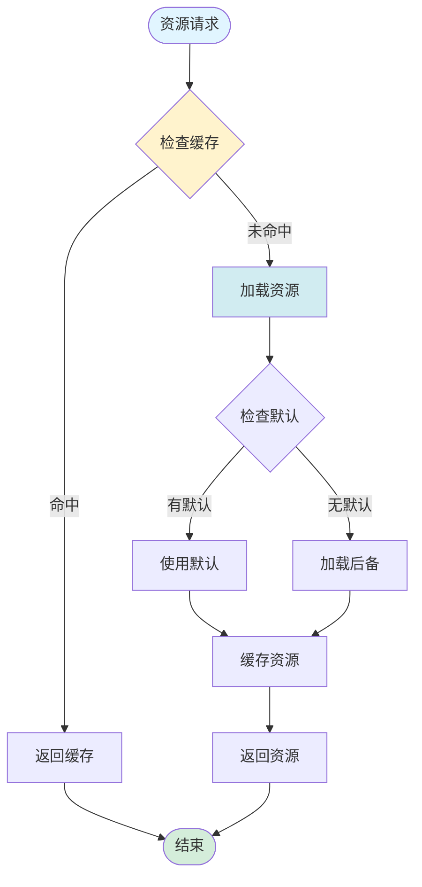

---

## 7. 主题系统

### 7.1 主题切换流程

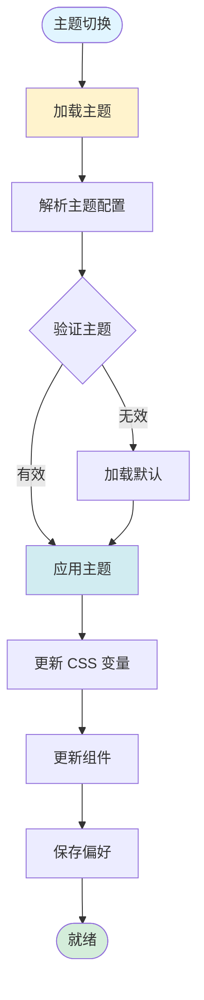

### 7.2 主题配置结构

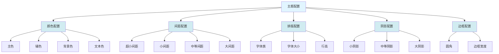

---

## 8. 插件扩展系统

### 8.1 插件加载流程

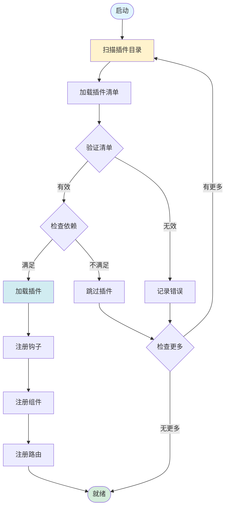

### 8.2 插件钩子系统

```mermaid
graph LR
    Plugin[插件] --> OnInit[初始化钩子]
    Plugin --> OnMount[挂载钩子]
    Plugin --> OnUpdate[更新钩子]
    Plugin --> OnUnmount[卸载钩子]
    
    OnInit --> InitPlugin[初始化插件]
    OnMount --> MountComponent[挂载组件]
    OnUpdate --> UpdateState[更新状态]
    OnUnmount --> Cleanup[清理资源]
    
    InitPlugin --> Ready([就绪])
    MountComponent --> Ready
    UpdateState --> Ready
    Cleanup --> Done([完成])
    
    style Plugin fill:#e1f5ff
    style Ready fill:#d4edda
    style Done fill:#d4edda
```

---

## 9. 测试策略

### 9.1 测试层级

```mermaid
graph TB
    Testing[测试策略]
    
    Testing --> UnitTest[单元测试]
    Testing --> IntegrationTest[集成测试]
    Testing --> E2ETest[E2E 测试]
    Testing --> PerformanceTest[性能测试]
    
    UnitTest --> TestUnit[测试单元]
    IntegrationTest --> TestIntegration[测试集成]
    E2ETest --> TestE2E[测试端到端]
    PerformanceTest --> TestPerformance[测试性能]
    
    TestUnit --> ReportUnit[报告单元]
    TestIntegration --> ReportIntegration[报告集成]
    TestE2E --> ReportE2E[报告 E2E]
    TestPerformance --> ReportPerformance[报告性能]
    
    ReportUnit --> Aggregate[汇总]
    ReportIntegration --> Aggregate
    ReportE2E --> Aggregate
    ReportPerformance --> Aggregate
    
    Aggregate --> Ready([就绪])
    
    style Testing fill:#e1f5ff
    style Ready fill:#d4edda
    style UnitTest fill:#d1ecf1
    style IntegrationTest fill:#d1ecf1
    style E2ETest fill:#d1ecf1
    style PerformanceTest fill:#d1ecf1
```

### 9.2 测试执行流程

```mermaid
sequenceDiagram
    participant Runner as 测试运行器
    participant Suite as 测试套件
    participant Test as 测试用例
    participant Mock as 模拟层
    participant Report as 报告生成器
    
    Runner->>Suite: 加载套件
    Suite->>Test: 执行测试
    
    loop 每个测试
        Test->>Mock: 设置模拟
        Test->>Test: 执行测试
        Test->>Test: 验证结果
        alt 测试通过
            Test-->>Suite: 通过
        else 测试失败
            Test-->>Suite: 失败
        end
    end
    
    Suite-->>Runner: 套件完成
    Runner->>Report: 生成报告
    Report-->>Runner: 返回报告
    
    Note over Runner,Report: 测试执行完成
```

---

## 10. CI/CD 流程

### 10.1 持续集成流程

```mermaid
graph TB
    Start([代码提交]) --> TriggerCI[触发 CI]
    TriggerCI --> CheckoutCode[检出代码]
    CheckoutCode --> InstallDeps[安装依赖]
    InstallDeps --> RunLint[运行 lint]
    RunLint --> RunTest[运行测试]
    
    RunTest --> CheckTest{测试通过？}
    CheckTest -->|是 | Build[构建应用]
    CheckTest -->|否 | FailCI[失败]
    
    Build --> RunE2E[运行 E2E]
    RunE2E --> CheckE2E{E2E 通过？}
    CheckE2E -->|是 | ScanSecurity[安全扫描]
    CheckE2E -->|否 | FailCI
    
    ScanSecurity --> CheckSecurity{安全通过？}
    CheckSecurity -->|是 | CreateArtifact[创建制品]
    CheckSecurity -->|否 | FailCI
    
    CreateArtifact --> Ready([就绪])
    FailCI --> Notify[通知失败]
    Notify --> End([结束])
    
    style Start fill:#e1f5ff
    style Ready fill:#d4edda
    style RunTest fill:#fff3cd
    style Build fill:#d1ecf1
    style ScanSecurity fill:#f8d7da
```

### 10.2 持续部署流程

```mermaid
sequenceDiagram
    participant Trigger as 触发器
    participant Deploy as 部署服务
    participant Stage1 as 阶段 1 环境
    participant Stage2 as 阶段 2 环境
    participant Prod as 生产环境
    participant Monitor as 监控系统
    
    Trigger->>Deploy: 触发部署
    Deploy->>Stage1: 部署到阶段 1
    Stage1-->>Deploy: 部署完成
    
    Deploy->>Monitor: 监控指标
    Monitor-->>Deploy: 健康检查
    
    alt 健康
        Deploy->>Stage2: 部署到阶段 2
        Stage2-->>Deploy: 部署完成
        
        Deploy->>Monitor: 监控指标
        Monitor-->>Deploy: 健康检查
        
        alt 健康
            Deploy->>Prod: 部署到生产
            Prod-->>Deploy: 部署完成
            
            Deploy->>Monitor: 持续监控
            Monitor-->>Deploy: 正常运行
        else 不健康
            Deploy->>Rollback1[回滚阶段 1]
            Rollback1-->>Deploy: 回滚完成
        end
    else 不健康
        Deploy->>Rollback0[回滚触发器]
        Rollback0-->>Deploy: 回滚完成
    end
    
    Note over Trigger,Monitor: 部署完成
```

---

## 总结

本章节涵盖了 DeerFlow 项目的高级特性流程图，包括：

1. **MCP 协议集成**：连接流程、资源管理、工具调用
2. **流式处理系统**：响应架构、SSE 传输、状态管理
3. **并发控制系统**：请求控制、子代理并发、线程池管理
4. **性能优化系统**：缓存策略、查询优化、批量处理
5. **安全机制**：输入验证、输出过滤、访问控制
6. **国际化系统**：语言切换、资源加载
7. **主题系统**：主题切换、配置结构
8. **插件扩展系统**：插件加载、钩子系统
9. **测试策略**：测试层级、执行流程
10. **CI/CD 流程**：持续集成、持续部署

这些流程图与前面的所有文档一起，构成了完整的 DeerFlow 项目技术文档体系，涵盖了从架构设计到实现细节的各个方面。
