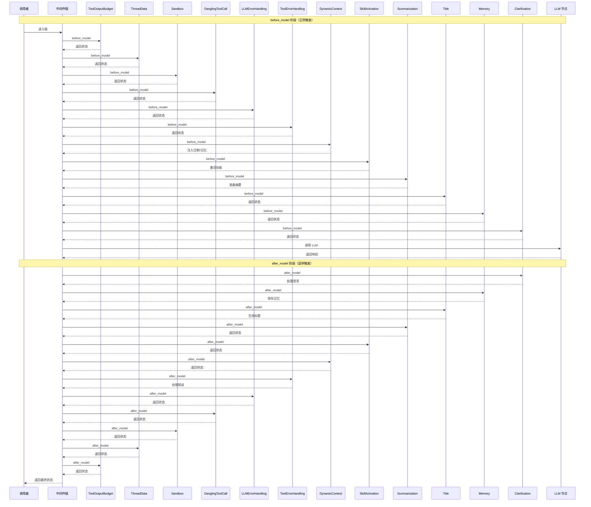
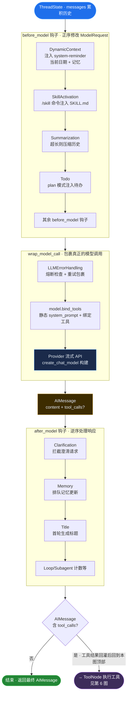
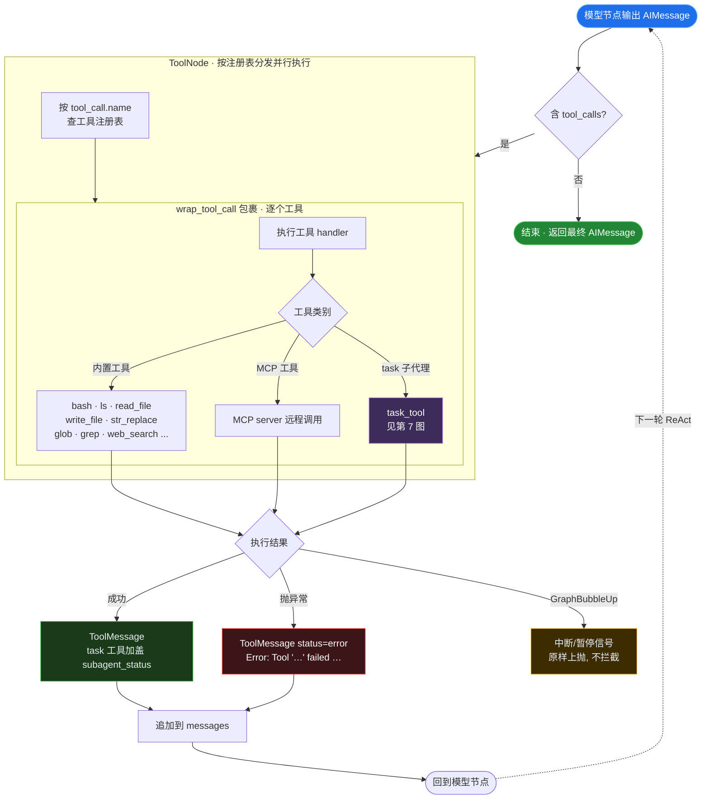
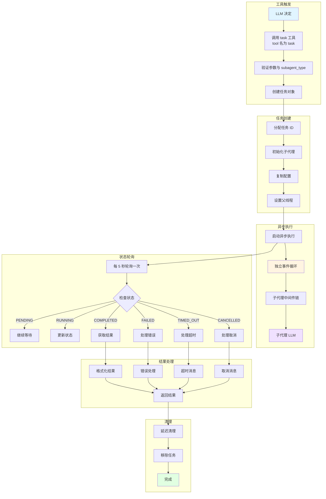
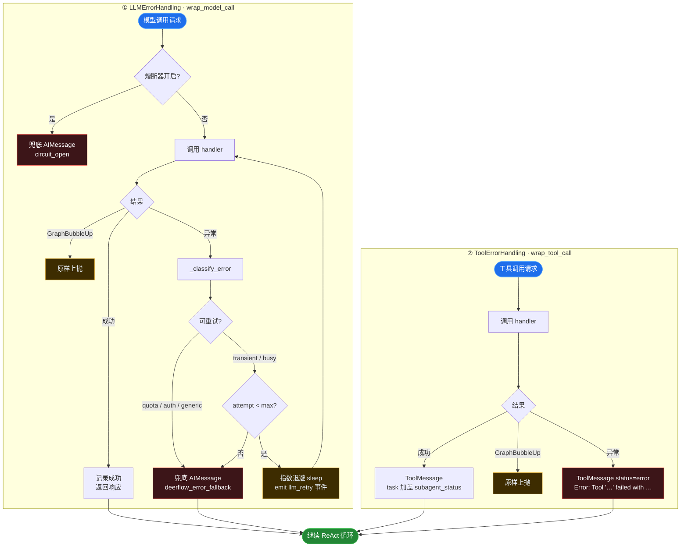

# DeerFlow Lead Agent 调用链图

本文档包含 Lead Agent 的完整调用链 Mermaid 流程图，展示从请求入口到最终响应的完整调用关系。

## 1. Lead Agent 构建图

> **重要修正**：代码中**不存在** `LeadAgentFactory` 工厂类。Lead Agent 由模块级函数 `make_lead_agent(config)`（`agent.py:402`）构建，内部调用 `build_middlewares(...)`（`agent.py:270`）装配中间件链，最终交给 LangChain `create_react_agent` / `create_agent` 编译为可执行图。

```mermaid
graph TB
    subgraph "入口函数"
        Entry[make_lead_agent&#40;config&#41;<br/>LangGraph 图工厂入口] --> ParseCfg[解析 RunnableConfig]
    end
    
    subgraph "配置解析"
        ParseCfg --> AppCfg[get_app_config]
        AppCfg --> ModelCfg[模型配置]
        AppCfg --> SkillsCfg[可用技能集合]
        ParseCfg --> RuntimeCfg[运行时配置<br/>is_plan_mode / subagent_enabled]
    end
    
    subgraph "中间件装配"
        RuntimeCfg --> BuildChain[build_middlewares<br/>两阶段条件构建]
        ModelCfg --> BuildChain
        BuildChain --> Runtime[build_lead_runtime_middlewares<br/>阶段1: 固定基础链]
        Runtime --> Append[阶段2: 条件性追加]
        SkillsCfg --> Append
    end
    
    subgraph "Agent 编译"
        Append --> MakeTools[装配工具<br/>内置/MCP/task]
        MakeTools --> CreateAgent[create_agent<br/>LangChain]
        CreateAgent --> Compile[编译为可执行图]
        Compile --> Agent[Lead Agent 实例]
    end
    
    style Entry fill:#e1f5ff
    style Agent fill:#e1ffe1
    style BuildChain fill:#fff4e1
    style Runtime fill:#f0e1ff
```

## 2. 请求处理调用链图

展示单个请求从 API 到响应的完整调用链。

```mermaid
graph TB
    subgraph "API 层"
        API[API Endpoint<br/>/api/runs] --> Controller[RunsController]
        Controller --> Validate[验证请求]
        Validate --> CreateRun[创建 Run 对象]
        CreateRun --> Stream[启动流式器]
    end
    
    subgraph "Agent 运行时"
        Stream --> Invoke[Agent.invoke<br/>异步]
        Invoke --> Execute[执行图节点]
        Execute --> State[获取 ThreadState]
    end
    
    subgraph "中间件链执行"
        State --> BeforeMiddleware[before_model 中间件链]
        
        BeforeMiddleware --> M1[ToolOutputBudget<br/>before_model]
        M1 --> M2[ThreadDataMiddleware<br/>before_model]
        M2 --> M3[UploadsMiddleware<br/>before_model]
        M3 --> M4[SandboxMiddleware<br/>before_model]
        M4 --> M5[DanglingToolCall<br/>before_model]
        M5 --> M6[DynamicContext<br/>before_model]
        M6 --> M7[SkillActivation<br/>before_model]
        M7 --> M8[Clarification<br/>总在最后]
        
        M8 --> CallAgent[调用 LLM 节点]
    end
    
    subgraph "LLM 执行"
        CallAgent --> BuildPrompt[构建提示词]
        BuildPrompt --> AddContext[添加上下文]
        AddContext --> LLMAPI[LLM API 调用]
        LLMAPI --> Response[获取响应]
        Response --> Parse[解析响应]
    end
    
    subgraph "工具执行"
        Parse --> ToolCheck{工具调用？}
        ToolCheck -->|是 | ToolExec[执行工具]
        ToolCheck -->|否 | Format[格式化输出]
        
        ToolExec --> ToolResult[工具结果]
        ToolResult --> UpdateState[更新状态]
        UpdateState --> CallAgent
    end
    
    subgraph "After 中间件"
        Format --> AfterMiddleware[after_model 中间件链 逆序]
        
        AfterMiddleware --> M9[Clarification<br/>after_model 先触发]
        M9 --> M10[LoopDetection<br/>after_model]
        M10 --> M11[SubagentLimit<br/>after_model]
        M11 --> M12[Memory<br/>after_model]
        M12 --> M13[Title<br/>after_model]
        M13 --> M14[ToolErrorHandling<br/>after_model 后触发]
    end
    
    subgraph "完成"
        M14 --> Yield[Yield 完成]
        Yield --> FinalState[返回最终状态]
        FinalState --> Persist[持久化]
        Persist --> SSE[SSE 完成事件]
    end
    
    style API fill:#e1f5ff
    style CallAgent fill:#fff4e1
    style ToolExec fill:#f0e1ff
    style Persist fill:#e1ffe1
    style SSE fill:#e1f5ff
```

## 3. 中间件链调用顺序图

> **修正说明**：实际为两阶段条件构建，最多 22 个中间件。`before_model` 按注册顺序触发，`after_model` 按注册逆序触发。下图展示典型完整链的钩子触发顺序（省略部分条件性中间件）。

## 4. 条件中间件启用图

> **修正说明**：旧版"有工具？/有沙盒？/需要澄清？"等判断多数是臆造的。下图依据 `_build_runtime_middlewares()`（`tool_error_handling_middleware.py:129`）与 `build_middlewares()`（`agent.py:270-377`）的真实代码编写。两点关键修正：① `GuardrailMiddleware` 注册在**基础链内部**（`LLMErrorHandling` 与 `SandboxAudit` 之间），不是基础链之后；② `ClarificationMiddleware` **永远最后注册**（无任何条件），并非旧版画的"需要澄清才启用"。
>
> 图例：**实心方块 = 总是注册**；**菱形 = 条件判断**；条件命中才会插入对应中间件。

```mermaid
graph TD
    Start([开始装配中间件链]) --> Phase1

    subgraph Phase1["阶段 1 · 基础运行时链 &#40;build_lead_runtime_middlewares&#41;"]
        direction TB
        B1[ToolOutputBudget] --> B2[ThreadData]
        B2 --> B3[Uploads<br/>仅 Lead Agent]
        B3 --> B4[Sandbox]
        B4 --> B5[DanglingToolCall]
        B5 --> B6[LLMErrorHandling]
        B6 --> GQ{guardrails.enabled<br/>且配置 provider?}
        GQ -->|是| BG[Guardrail]
        GQ -->|否| B7
        BG --> B7[SandboxAudit]
        B7 --> B8[ToolErrorHandling]
    end

    B8 --> P2A[DynamicContext<br/>注入日期/记忆]
    P2A --> P2B[SkillActivation]

    subgraph Phase2["阶段 2 · 条件追加 &#40;build_middlewares&#41;"]
        direction TB
        P2B --> C1{summarization<br/>.enabled?}
        C1 -->|是| A1[Summarization]
        C1 -->|否| C2
        A1 --> C2{is_plan_mode?}
        C2 -->|是| A2[Todo]
        C2 -->|否| C3
        A2 --> C3{token_usage<br/>.enabled?}
        C3 -->|是| A3[TokenUsage]
        C3 -->|否| FIX1
        A3 --> FIX1[Title 总是注册]
        FIX1 --> FIX2[Memory 总是注册]
        FIX2 --> C4{model<br/>.supports_vision?}
        C4 -->|是| A4[ViewImage]
        C4 -->|否| C5
        A4 --> C5{deferred_setup<br/>有 deferred 工具?}
        C5 -->|是| A5[DeferredToolFilter]
        C5 -->|否| C6
        A5 --> C6{subagent_enabled?}
        C6 -->|是| A6[SubagentLimit<br/>max=3]
        C6 -->|否| C7
        A6 --> C7{loop_detection<br/>.enabled?}
        C7 -->|是| A7[LoopDetection]
        C7 -->|否| CUS
        A7 --> CUS[custom_middlewares<br/>注入点]
        CUS --> C8{safety_finish_reason<br/>.enabled?}
        C8 -->|是| A8[SafetyFinishReason]
        C8 -->|否| CLA
        A8 --> CLA[Clarification<br/>★ 永远最后]
    end

    CLA --> End([返回完整中间件链<br/>最多 22 个])

    style Start fill:#1f6feb,stroke:#58a6ff,color:#fff
    style End fill:#238636,stroke:#3fb950,color:#fff
    style BG fill:#3c1518,stroke:#f85149,color:#fff
    style FIX1 fill:#1a3a1a,stroke:#3fb950,color:#e6edf3
    style FIX2 fill:#1a3a1a,stroke:#3fb950,color:#e6edf3
    style CLA fill:#3d2c00,stroke:#e3b341,color:#e6edf3
    style P2A fill:#1a2a4a,stroke:#58a6ff,color:#e6edf3
    style P2B fill:#1a2a4a,stroke:#58a6ff,color:#e6edf3
```

**真实启用条件速查表**：

| 中间件 | 启用条件 | 代码位置 |
|---|---|---|
| ThreadData / Sandbox / Title / Memory | 总是注册 | agent.py |
| Summarization | `summarization.enabled` | agent.py:316 |
| Todo | `is_plan_mode == True` | agent.py:322 |
| TokenUsage | `token_usage.enabled` | agent.py:328 |
| ViewImage | `model_config.supports_vision` | agent.py:340 |
| SubagentLimit | `subagent_enabled`，max 默认 3 | agent.py:352 |
| LoopDetection | `loop_detection.enabled` | agent.py:359 |
| Guardrail | `guardrails.enabled` 且配置 `provider`（注册在基础链内部） | tool_error_handling_middleware.py:162 |
| SafetyFinishReason | `safety_finish_reason.enabled` | agent.py:372 |
| Clarification | **总是注册，必为最后** | agent.py:376 |

## 5. LLM 节点调用图

> **修正说明**：旧版臆造了"提取消息→构建历史→选择模型→温度/MaxTokens/Top P"等步骤。实际上 Lead Agent 由 LangChain `create_agent` 编译为 **ReAct 图**，并**没有**自定义 LLM 节点。模型节点的行为由中间件钩子决定：`before_model` 钩子按注册顺序修改 `ModelRequest`（注入上下文），`wrap_model_call` 包裹真正的模型调用（重试/降级），`after_model` 钩子按**逆序**处理响应。下图展示这一真实结构。

## 6. 工具调用处理图

> **修正说明**：旧版"验证参数→获取工具→再次调用 LLM→继续？"是泛化描述。实际工具执行由 LangChain `ToolNode` 完成：模型产出 `tool_calls` 后进入 `ToolNode`，按工具名从注册表分发；`ToolErrorHandlingMiddleware.wrap_tool_call` 包裹每次调用，捕获异常并把结果统一封装为 `ToolMessage` 回灌历史，再回到模型节点形成 ReAct 循环，直到某次响应不含 `tool_calls` 为止。

## 7. 子代理工具调用图

展示子代理工具 `task_tool` 的完整调用链。

## 8. 错误处理调用图

> **修正说明**：旧版臆造了"预算错误/系统错误/安全模式/降级处理"等分支。实际错误处理由**两个独立中间件**承担，职责清晰：
> - **LLMErrorHandling**（`wrap_model_call`）：包裹模型调用，分类错误→可重试则指数退避重试→失败兜底为 `AIMessage`，并带熔断器。
> - **ToolErrorHandling**（`wrap_tool_call`）：包裹工具调用，捕获异常→封装为 `status=error` 的 `ToolMessage`→让 ReAct 循环继续。
>
> 二者均放行 `GraphBubbleUp`（中断/暂停/恢复等 LangGraph 控制流信号）。

## 图表说明

### 组件颜色图例
- `#e1f5ff` (蓝色): 输入/起始状态
- `#fff4e1` (黄色): 处理/执行状态
- `#f0e1ff` (紫色): 特殊功能/子代理
- `#e1ffe1` (绿色): 完成/输出状态
- `#ffe1e1` (红色): 错误/异常状态

### 关键调用链
1. **请求处理链**: API → Agent → before_model 链 → 模型节点 → ToolNode → after_model 链（逆序）→ 响应
2. **中间件链**: 最多 22 个中间件，两阶段条件构建，before_model 正序、after_model 逆序触发
3. **工具执行链**: 模型产出 tool_calls → ToolNode 按注册表分发（内置/MCP/task）→ wrap_tool_call 包裹 → ToolMessage 回灌 → 回到模型节点循环
4. **子代理链**: 触发（task 工具）→ 创建 → ThreadPoolExecutor 异步执行 → 每 5 秒轮询 → 结果 → 清理

### 设计模式
1. **图工厂模式**: `make_lead_agent` 作为 LangGraph 图工厂函数构建 Lead Agent（非工厂类）
2. **责任链模式**: 中间件链通过顺序调用实现关注点分离
3. **策略模式**: 不同工具类型使用不同的执行策略
4. **异步模式**: 子代理（ThreadPoolExecutor + 独立事件循环）和记忆提取使用异步执行
5. **状态模式**: ThreadState 管理所有运行时状态

### 扩展性设计
- 中间件可插拔，通过条件启用控制
- 工具系统支持内置、MCP、子代理等多种类型
- 模型配置可动态选择
- 错误处理策略可配置
